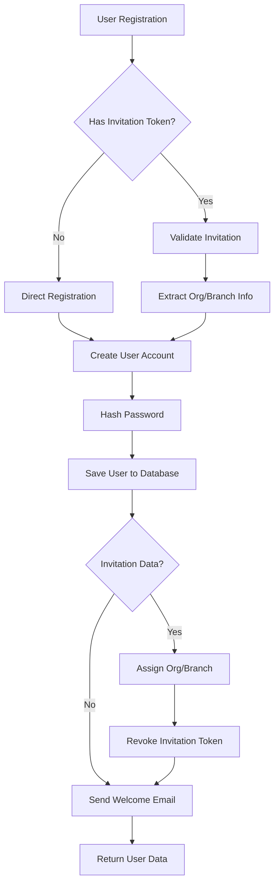
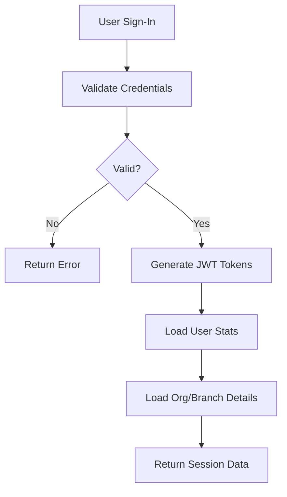
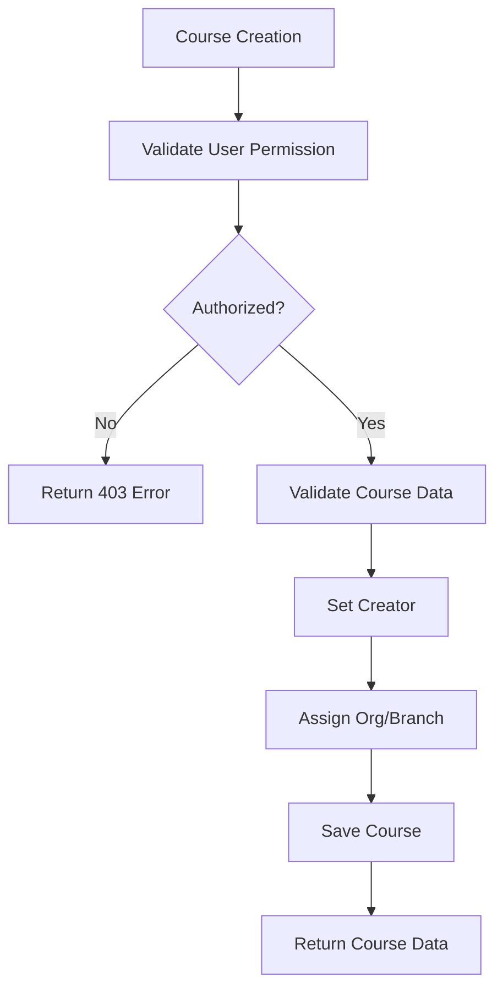
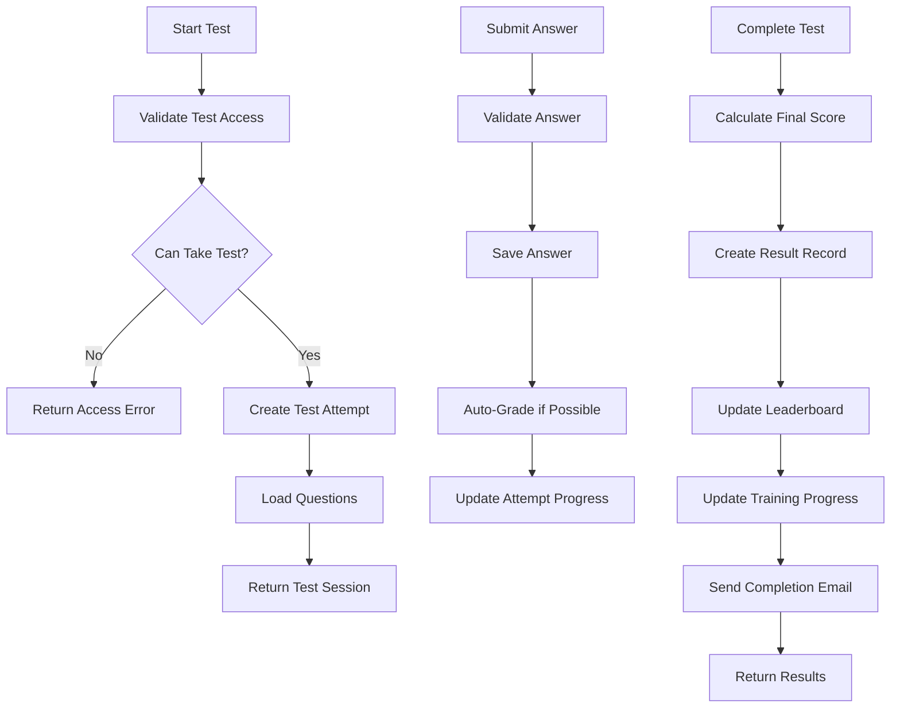
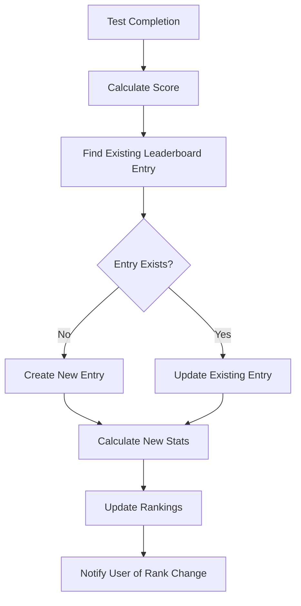
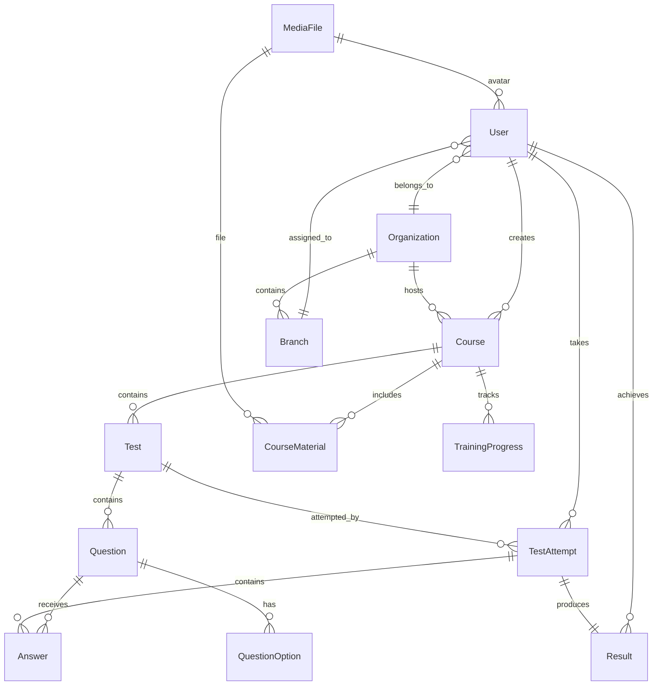

# 🚀 trainpro Server - Comprehensive Documentation

## 📋 Table of Contents

- [🏗️ Tech Stack](#-tech-stack)
- [📁 Application Architecture](#-application-architecture)
- [🔧 Core Modules Deep Dive](#-core-modules-deep-dive)
- [🛠️ Developer Setup](#-developer-setup)
- [👤 User Process Flows](#-user-process-flows)
- [🔒 Security & Authentication](#-security--authentication)
- [📊 Database Schema](#-database-schema)
- [🚀 Deployment Guide](#-deployment-guide)

---

## 🏗️ Tech Stack

### **Backend Framework & Language**
- **NestJS 11.0+** - Progressive Node.js framework with TypeScript
- **TypeScript 5.7+** - Strongly typed JavaScript superset
- **Node.js 18+** - JavaScript runtime environment

### **Database & ORM**
- **MySQL 8+** - Primary database with UTF-8 support
- **TypeORM 0.3+** - TypeScript ORM with advanced features
- **Connection Pooling** - Optimized database connections with retry logic

### **Authentication & Security**
- **JWT (JSON Web Tokens)** - Stateless authentication
- **Passport.js** - Authentication middleware
- **Bcrypt** - Password hashing with 12 salt rounds
- **Helmet** - Security headers middleware
- **Throttling** - Rate limiting and API protection

### **API Documentation & Validation**
- **Swagger/OpenAPI 3.0** - Interactive API documentation
- **Class Validator** - DTO validation decorators
- **Class Transformer** - Object transformation utilities

### **Communication & Messaging**
- **Nodemailer** - Email sending capabilities
- **Handlebars** - Email template engine
- **MJML** - Responsive email framework
- **BullMQ** - Background job processing

### **File Management & Storage**
- **Multer** - File upload handling
- **Sharp** - Image processing and optimization
- **Google Cloud Storage** - Cloud file storage (optional)

### **Performance & Monitoring**
- **Cache Manager** - Redis-based caching
- **Event Emitters** - Asynchronous event handling
- **Health Checks** - Application monitoring
- **Logging** - Structured application logging

### **Development Tools**
- **ESLint** - Code linting and quality
- **Prettier** - Code formatting
- **Jest** - Testing framework
- **Supertest** - API testing utilities

---

## 📁 Application Architecture

### **Main Application Structure**

```
server/src/
├── 🏠 app.module.ts           # Root application module
├── 🚀 main.ts                 # Application bootstrap
├── 📋 app.controller.ts       # System information endpoints
├── ⚙️ app.service.ts          # Core application services
│
├── 🔐 auth/                   # Authentication Module
├── 👤 user/                   # User Management Module
├── 🎓 course/                 # Course Management Module
├── 📝 test/                   # Test/Exam Module
├── ❓ questions/              # Question Bank Module
├── 🔢 questions_options/      # Answer Options Module
├── ✍️ test_attempts/          # Test Taking Module
├── 📝 answers/                # Answer Management Module
├── 📊 results/                # Results & Analytics Module
├── 🏆 leaderboard/           # Gamification Module
├── 📈 training_progress/      # Progress Tracking Module
├── 📋 reports/                # Reporting Module
├── 💬 communications/         # Email & Notifications Module
├── 🏢 org/                    # Organization Module
├── 🏪 branch/                 # Branch Management Module
├── 📁 media-manager/          # File Management Module
├── 📚 course-materials/       # Course Content Module
└── 🛠️ common/                # Shared Utilities
```

### **Database Entities Overview**

The application uses 13 core entities with optimized relationships:

- **User** - User accounts with role-based access
- **Organization** - Top-level organizational structure
- **Branch** - Department/location subdivisions
- **Course** - Learning content containers
- **CourseMaterial** - Course content files
- **Test** - Examinations and quizzes
- **Question** - Question bank with multiple types
- **QuestionOption** - Answer choices for questions
- **TestAttempt** - Student test sessions
- **Answer** - Student responses and marking
- **Result** - Calculated test results
- **Leaderboard** - Gamification rankings
- **TrainingProgress** - Learning progress tracking
- **MediaFile** - File storage and variants
- **Communication** - Email and notification logs

---

## 🔧 Core Modules Deep Dive

### 🔐 **Authentication Module (`/auth`)**

**Purpose**: Handles user authentication, registration, and security flows

#### **Key Files**:
- `auth.controller.ts` - Authentication endpoints (67KB, 1744 lines)
- `auth.service.ts` - Business logic for auth operations (30KB, 898 lines)
- `token-manager.service.ts` - JWT token management (11KB, 393 lines)
- `jwt.strategy.ts` - Passport JWT strategy
- `jwt-auth.guard.ts` - Route protection guard

#### **DTOs (Data Transfer Objects)**:
- `forgot-password.dto.ts` - Email for password reset
- `reset-password.dto.ts` - Token-based password reset
- `send-invitation.dto.ts` - Organization invitations
- `validate-invitation.dto.ts` - Invitation validation

#### **Key Features**:
- **User Registration** with organization invitations
- **JWT Authentication** with access and refresh tokens
- **Password Reset** via email tokens
- **Email Verification** system
- **Invitation System** for organization onboarding
- **Token Management** with expiration and refresh

#### **Security Features**:
- 12-round bcrypt password hashing
- JWT token expiration management
- Rate limiting on auth endpoints
- Email-based verification flows
- Invitation token validation

---

### 👤 **User Management Module (`/user`)**

**Purpose**: Comprehensive user profile and account management

#### **Key Files**:
- `user.controller.ts` - User management endpoints (33KB, 992 lines)
- `user.service.ts` - User business logic with caching (23KB, 736 lines)
- `user.module.ts` - Module configuration

#### **Entity Structure** (`user.entity.ts`):
```typescript
@Entity('users')
export class User {
    @PrimaryGeneratedColumn('uuid') id: string;
    @Column({ unique: true }) email: string;
    @Column() @Exclude({ toPlainOnly: true }) password: string;
    @Column() firstName: string;
    @Column() lastName: string;
    @ManyToOne(() => MediaFile) avatar?: MediaFile;
    @Column({ default: UserRole.USER }) role?: UserRole;
    @Column({ default: false }) emailVerified: boolean;
    @Column({ default: UserStatus.ACTIVE }) status: UserStatus;
    @ManyToOne(() => Organization) orgId?: Organization;
    @ManyToOne(() => Branch) branchId?: Branch;
    
    // Relationships
    @OneToMany(() => Course, 'creator') createdCourses: Course[];
    @OneToMany(() => TestAttempt, 'user') testAttempts: TestAttempt[];
    @OneToMany(() => Result, 'user') results: Result[];
}
```

#### **User Roles & Status**:
```typescript
export enum UserRole {
    BRANDON = 'brandon',    // Super admin
    OWNER = 'owner',        // Organization owner
    ADMIN = 'admin',        // Organization admin
    USER = 'user'           // Regular user
}

export enum UserStatus {
    ACTIVE = 'active',
    INACTIVE = 'inactive',
    DELETED = 'deleted',
    SUSPENDED = 'suspended'
}
```

#### **DTOs**:
- `create-user.dto.ts` - User registration data
- `update-user.dto.ts` - Profile update data
- `change-password.dto.ts` - Password change flow
- `sign-in.dto.ts` - Login credentials
- `session-response.dto.ts` - Authentication session data
- `assign-org-branch.dto.ts` - Organization assignment

#### **Key Features**:
- **Profile Management** with avatar support
- **Organization Assignment** to branches
- **Caching Strategy** for performance optimization
- **Soft Delete** functionality
- **Bulk Operations** for user management
- **Avatar Variants** with image optimization
- **Event-Driven** architecture for user actions

#### **Service Methods**:
- `create()` - User registration with event emission
- `findByEmail()` - Cached user lookup
- `updateProfile()` - Profile updates with cache invalidation
- `changePassword()` - Secure password changes
- `assignOrgAndBranch()` - Organizational assignment
- `softDelete()` - Safe user removal

---

### 🎓 **Course Management Module (`/course`)**

**Purpose**: Educational content organization and management

#### **Key Files**:
- `course.controller.ts` - Course management API (25KB, 810 lines)
- `course.service.ts` - Course business logic (24KB, 739 lines)
- `course.module.ts` - Module configuration

#### **Entity Structure**:
```typescript
@Entity('courses')
export class Course {
    @PrimaryGeneratedColumn('uuid') id: string;
    @Column() title: string;
    @Column('text') description: string;
    @ManyToOne(() => User) creator: User;
    @ManyToOne(() => Organization) organization?: Organization;
    @ManyToOne(() => Branch) branch?: Branch;
    @Column({ default: true }) isActive: boolean;
    
    // Relationships
    @OneToMany(() => Test, 'course') tests: Test[];
    @OneToMany(() => CourseMaterial, 'course') materials: CourseMaterial[];
    @OneToMany(() => TrainingProgress, 'course') progress: TrainingProgress[];
}
```

#### **DTOs**:
- `create-course.dto.ts` - Course creation data
- `update-course.dto.ts` - Course modification data
- `course-statistics.dto.ts` - Analytics and metrics

#### **Key Features**:
- **Hierarchical Organization** (Org → Branch → Course)
- **Creator Ownership** with access control
- **Course Statistics** and analytics
- **Test Management** within courses
- **Material Attachment** and organization
- **Progress Tracking** for learners

---

### 📝 **Test Management Module (`/test`)**

**Purpose**: Examination and quiz creation and management

#### **Key Files**:
- `test.controller.ts` - Test management API (29KB, 980 lines)
- `test.service.ts` - Test business logic (21KB, 615 lines)

#### **Entity Structure**:
```typescript
@Entity('tests')
export class Test {
    @PrimaryGeneratedColumn('uuid') id: string;
    @Column() title: string;
    @Column('text') description: string;
    @ManyToOne(() => Course) course: Course;
    @ManyToOne(() => User) creator: User;
    @Column({ nullable: true }) timeLimit?: number;
    @Column({ default: 1 }) maxAttempts: number;
    @Column({ default: false }) isActive: boolean;
    @Column({ type: 'enum', enum: TestType }) testType: TestType;
    
    // Relationships
    @OneToMany(() => Question, 'test') questions: Question[];
    @OneToMany(() => TestAttempt, 'test') attempts: TestAttempt[];
}
```

#### **Test Types**:
```typescript
export enum TestType {
    EXAM = 'exam',
    QUIZ = 'quiz',
    TRAINING = 'training',
    ASSESSMENT = 'assessment'
}
```

#### **Key Features**:
- **Multiple Test Types** (exams, quizzes, training)
- **Time Management** with configurable limits
- **Attempt Control** with retry policies
- **Question Organization** and ordering
- **Activation Control** for release management
- **Performance Analytics** and insights

---

### ❓ **Questions Module (`/questions`)**

**Purpose**: Question bank management with multiple question types

#### **Key Files**:
- `questions.controller.ts` - Question management API (20KB, 642 lines)
- `questions.service.ts` - Question business logic (27KB, 809 lines)

#### **Entity Structure**:
```typescript
@Entity('questions')
export class Question {
    @PrimaryGeneratedColumn('uuid') id: string;
    @Column() questionText: string;
    @Column({ type: 'enum', enum: QuestionType }) type: QuestionType;
    @ManyToOne(() => Test) test: Test;
    @Column() points: number;
    @Column() orderIndex: number;
    @Column({ nullable: true }) explanation?: string;
    
    // Relationships
    @OneToMany(() => QuestionOption, 'question') options: QuestionOption[];
    @OneToMany(() => Answer, 'question') answers: Answer[];
}
```

#### **Question Types**:
```typescript
export enum QuestionType {
    MULTIPLE_CHOICE = 'multiple_choice',
    TRUE_FALSE = 'true_false',
    SHORT_ANSWER = 'short_answer',
    ESSAY = 'essay',
    FILL_IN_BLANK = 'fill_in_blank'
}
```

#### **Key Features**:
- **Multiple Question Types** support
- **Question Ordering** and organization
- **Point Assignment** for scoring
- **Bulk Operations** for efficiency
- **Answer Options** management
- **Explanation Support** for learning

---

### 🔢 **Question Options Module (`/questions_options`)**

**Purpose**: Answer choices for multiple choice and true/false questions

#### **Entity Structure**:
```typescript
@Entity('question_options')
export class QuestionOption {
    @PrimaryGeneratedColumn('uuid') id: string;
    @Column() optionText: string;
    @Column() isCorrect: boolean;
    @ManyToOne(() => Question) question: Question;
    @Column() orderIndex: number;
}
```

---

### ✍️ **Test Attempts Module (`/test_attempts`)**

**Purpose**: Student test-taking sessions and progress tracking

#### **Entity Structure**:
```typescript
@Entity('test_attempts')
export class TestAttempt {
    @PrimaryGeneratedColumn('uuid') id: string;
    @ManyToOne(() => Test) test: Test;
    @ManyToOne(() => User) user: User;
    @Column() startTime: Date;
    @Column({ nullable: true }) endTime?: Date;
    @Column({ type: 'enum', enum: AttemptStatus }) status: AttemptStatus;
    @Column({ nullable: true }) score?: number;
    
    // Relationships
    @OneToMany(() => Answer, 'attempt') answers: Answer[];
    @OneToMany(() => Result, 'attempt') results: Result[];
}
```

---

### 📝 **Answers Module (`/answers`)**

**Purpose**: Student response collection and marking system

#### **Entity Structure**:
```typescript
@Entity('answers')
export class Answer {
    @PrimaryGeneratedColumn('uuid') id: string;
    @ManyToOne(() => Question) question: Question;
    @ManyToOne(() => TestAttempt) attempt: TestAttempt;
    @Column('text') answerText: string;
    @Column({ nullable: true }) isCorrect?: boolean;
    @Column({ nullable: true }) points?: number;
    @ManyToOne(() => User) markedByUser?: User;
    @Column({ nullable: true }) feedback?: string;
}
```

---

### 📊 **Results Module (`/results`)**

**Purpose**: Test result calculation and analytics

#### **Entity Structure**:
```typescript
@Entity('results')
export class Result {
    @PrimaryGeneratedColumn('uuid') id: string;
    @ManyToOne(() => TestAttempt) attempt: TestAttempt;
    @ManyToOne(() => User) user: User;
    @Column() score: number;
    @Column() maxScore: number;
    @Column() percentage: number;
    @Column() passed: boolean;
    @Column() completionTime: number;
}
```

---

### 🏆 **Leaderboard Module (`/leaderboard`)**

**Purpose**: Gamification with rankings and achievements

#### **Entity Structure**:
```typescript
@Entity('leaderboards')
export class Leaderboard {
    @PrimaryGeneratedColumn('uuid') id: string;
    @ManyToOne(() => User) user: User;
    @ManyToOne(() => Course) course: Course;
    @Column() totalScore: number;
    @Column() testsCompleted: number;
    @Column() averageScore: number;
    @Column() rank: number;
}
```

---

### 📈 **Training Progress Module (`/training_progress`)**

**Purpose**: Learning path tracking and completion monitoring

#### **Entity Structure**:
```typescript
@Entity('training_progress')
export class TrainingProgress {
    @PrimaryGeneratedColumn('uuid') id: string;
    @ManyToOne(() => User) user: User;
    @ManyToOne(() => Course) course: Course;
    @Column() completionPercentage: number;
    @Column() testsCompleted: number;
    @Column() totalTests: number;
    @Column() lastAccessed: Date;
}
```

---

### 📋 **Reports Module (`/reports`)**

**Purpose**: Analytics and reporting system

#### **Key Features**:
- **Performance Analytics** across users and courses
- **Score Distribution** analysis
- **Completion Rate** tracking
- **Export Capabilities** for data analysis
- **Time-based Reports** for progress monitoring

---

### 💬 **Communications Module (`/communications`)**

**Purpose**: Email notifications and messaging system

#### **Key Components**:
- **Email Templates** with Handlebars and MJML
- **Background Jobs** with BullMQ
- **Email Queue** with priority handling
- **Template Management** for different email types
- **Event Listeners** for automated notifications

#### **Email Types**:
- Welcome emails for new users
- Password reset notifications
- Email verification messages
- Invitation emails for organizations
- Test completion notifications
- Progress update emails

---

### 🏢 **Organization Module (`/org`)**

**Purpose**: Top-level organizational structure management

#### **Key Features**:
- **Organization Creation** and management
- **Branding Support** with logos and colors
- **User Management** within organizations
- **Settings Configuration** for organization policies
- **Branch Management** under organizations

---

### 🏪 **Branch Module (`/branch`)**

**Purpose**: Department/location subdivision management

#### **Key Features**:
- **Branch Creation** under organizations
- **Manager Assignment** and contact information
- **User Assignment** to specific branches
- **Course Assignment** at branch level
- **Performance Tracking** by branch

---

### 📁 **Media Manager Module (`/media-manager`)**

**Purpose**: File storage and image optimization

#### **Entity Structure**:
```typescript
@Entity('media_files')
export class MediaFile {
    @PrimaryGeneratedColumn() id: number;
    @Column() originalName: string;
    @Column() filename: string;
    @Column() mimeType: string;
    @Column() size: number;
    @Column() url: string;
    @Column({ type: 'enum', enum: ImageVariant }) variant?: ImageVariant;
    @Column({ nullable: true }) originalFileId?: number;
    
    // Relationships
    @OneToMany(() => MediaFile, 'originalFileId') variants?: MediaFile[];
}
```

#### **Key Features**:
- **Image Variants** (thumbnail, medium, original)
- **File Upload** handling with validation
- **Cloud Storage** integration
- **Image Optimization** with Sharp
- **URL Generation** for file access

---

### 📚 **Course Materials Module (`/course-materials`)**

**Purpose**: Course content file management

#### **Entity Structure**:
```typescript
@Entity('course_materials')
export class CourseMaterial {
    @PrimaryGeneratedColumn('uuid') id: string;
    @Column() title: string;
    @Column('text') description: string;
    @ManyToOne(() => Course) course: Course;
    @ManyToOne(() => MediaFile) file: MediaFile;
    @Column() orderIndex: number;
    @Column({ default: true }) isActive: boolean;
}
```

---

## 🛠️ Developer Setup

### **Prerequisites**

1. **Node.js 18+** - JavaScript runtime
2. **Yarn** - Package manager (recommended)
3. **MySQL 8+** - Database server
4. **Git** - Version control

### **Environment Setup**

1. **Clone the Repository**:
```bash
git clone <repository-url>
cd trainpro/server
```

2. **Install Dependencies**:
```bash
yarn install
```

3. **Environment Configuration**:
```bash
cp .env.example .env
```

Edit `.env` with your configuration:
```bash
# Database Configuration
DATABASE_HOST=localhost
DATABASE_PORT=3306
DATABASE_USERNAME=your_username
DATABASE_PASSWORD=your_password
DATABASE_NAME=trainpro_dev

# JWT Configuration
JWT_SECRET=your-super-secret-jwt-key-at-least-32-characters
JWT_EXPIRES_IN=1h
JWT_REFRESH_EXPIRES_IN=7d

# Application Settings
NODE_ENV=development
PORT=4400

# Email Configuration (Optional for development)
SMTP_HOST=smtp.gmail.com
SMTP_PORT=587
SMTP_USER=your-email@gmail.com
SMTP_PASS=your-app-password

# Rate Limiting
THROTTLE_TTL=60000
THROTTLE_LIMIT=10
```

4. **Database Setup**:
```bash
# Create database
mysql -u root -p -e "CREATE DATABASE trainpro_dev;"

# The application will auto-create tables via TypeORM synchronization
```

### **Development Workflow**

1. **Start Development Server**:
```bash
yarn start:dev
```

2. **Available Scripts**:
```bash
yarn build              # Build production bundle
yarn start              # Start production server
yarn start:dev          # Development with hot reload
yarn start:debug        # Debug mode with inspector
yarn lint               # Run ESLint
yarn format             # Format code with Prettier
yarn test               # Run unit tests
yarn test:watch         # Test in watch mode
yarn test:e2e           # End-to-end tests
yarn test:cov           # Test coverage report
```

3. **API Documentation**:
- **Swagger UI**: `http://localhost:4400/api`
- **Health Check**: `http://localhost:4400/health`
- **System Info**: `http://localhost:4400/system-info`

### **Database Management**

The application uses TypeORM with automatic synchronization in development:

```typescript
// Database configuration in app.module.ts
TypeOrmModule.forRootAsync({
    useFactory: (configService: ConfigService) => ({
        type: 'mysql',
        host: configService.get('DATABASE_HOST'),
        // ... other config
        synchronize: true, // Auto-create/update tables
        logging: false,    // Set to true for SQL logging
        entities: [/* All entities */],
    }),
})
```

### **Testing Strategy**

1. **Unit Tests**: Test individual services and methods
2. **Integration Tests**: Test controller endpoints
3. **E2E Tests**: Test complete user flows
4. **Database Tests**: Test entity relationships

Example test structure:
```bash
src/
├── user/
│   ├── user.service.spec.ts      # Unit tests
│   ├── user.controller.spec.ts   # Integration tests
test/
├── app.e2e-spec.ts              # E2E tests
```

---

## 👤 User Process Flows

### **🔐 Authentication Flow**

#### **1. User Registration Process**



**API Endpoint**: `POST /auth/signup`

**Request Body**:
```json
{
    "email": "user@example.com",
    "password": "securePassword123",
    "firstName": "John",
    "lastName": "Doe",
    "avatar": 123,
    "invitationToken": "optional-invitation-token"
}
```

**Response**:
```json
{
    "success": true,
    "data": {
        "user": {
            "uid": "uuid",
            "email": "user@example.com",
            "firstName": "John",
            "lastName": "Doe",
            "avatar": { "id": 123, "url": "...", "thumbnail": "..." },
            "role": "user",
            "createdAt": "2025-01-01T00:00:00.000Z"
        },
        "organization": { "id": "org-id", "name": "Org Name" },
        "branch": { "id": "branch-id", "name": "Branch Name" }
    },
    "message": "Account created successfully. Please sign in with your credentials."
}
```

#### **2. User Sign-In Process**



**API Endpoint**: `POST /auth/signin`

**Request Body**:
```json
{
    "email": "user@example.com",
    "password": "securePassword123"
}
```

**Response**:
```json
{
    "success": true,
    "data": {
        "tokens": {
            "accessToken": "jwt-access-token",
            "refreshToken": "jwt-refresh-token",
            "expiresIn": 3600
        },
        "user": {
            "uid": "uuid",
            "email": "user@example.com",
            "firstName": "John",
            "lastName": "Doe",
            "avatar": { "id": 123, "url": "...", "thumbnail": "..." },
            "role": "user"
        },
        "stats": {
            "totalScore": 850,
            "testsCompleted": 15,
            "averageScore": 87.5,
            "rank": 5,
            "courseCount": 3
        },
        "organization": { "id": "org-id", "name": "Organization Name" },
        "branch": { "id": "branch-id", "name": "Branch Name" }
    },
    "message": "Sign in successful"
}
```

#### **3. Password Reset Flow**

```mermaid
graph TD
    A[Forgot Password Request] --> B[Find User by Email]
    B --> C{User Exists?}
    C -->|No| D[Return Success (Security)]
    C -->|Yes| E[Generate Reset Token]
    E --> F[Save Token to Database]
    F --> G[Send Reset Email]
    G --> H[Return Success Response]
    
    I[Password Reset] --> J[Validate Token]
    J --> K{Token Valid?}
    K -->|No| L[Return Error]
    K -->|Yes| M[Hash New Password]
    M --> N[Update User Password]
    N --> O[Invalidate Reset Token]
    O --> P[Return Success]
```

---

### **📚 Course Management Flow**

#### **1. Course Creation Process**



**API Endpoint**: `POST /courses`

**Request Body**:
```json
{
    "title": "Introduction to TypeScript",
    "description": "A comprehensive course on TypeScript fundamentals",
    "organizationId": "org-uuid",
    "branchId": "branch-uuid"
}
```

#### **2. Test Taking Flow**



---

### **🏆 Gamification Flow**

#### **Leaderboard Update Process**



---

## 🔒 Security & Authentication

### **Authentication Strategy**

1. **JWT-Based Authentication**:
   - Access tokens: 1-hour expiration
   - Refresh tokens: 7-day expiration
   - Token rotation on refresh

2. **Password Security**:
   - Bcrypt hashing with 12 salt rounds
   - Password complexity requirements
   - Current password verification for changes

3. **Rate Limiting**:
   - Short: 10 requests/minute
   - Medium: 50 requests/10 minutes
   - Long: 100 requests/hour

4. **Role-Based Access Control**:
   - BRANDON: Super admin access
   - OWNER: Organization owner
   - ADMIN: Organization admin
   - USER: Regular user

### **API Security Headers**

```typescript
// Helmet security configuration
app.use(helmet({
    contentSecurityPolicy: false, // For Swagger UI
    xPoweredBy: false,           // Hide server info
}));
```

### **Database Security**

1. **Connection Pooling**:
   - Maximum 20 connections
   - 30-second timeouts
   - Automatic retry logic

2. **SQL Injection Prevention**:
   - TypeORM parameterized queries
   - Input validation with class-validator

3. **Data Encryption**:
   - Password hashing with bcrypt
   - JWT secret key protection

---

## 📊 Database Schema

### **Core Relationships**



### **Database Indexes**

```sql
-- User indexes for performance
CREATE INDEX IDX_USER_EMAIL ON users(email);
CREATE INDEX IDX_USER_CREATED_AT ON users(createdAt);
CREATE INDEX IDX_USER_NAME_SEARCH ON users(firstName, lastName);

-- Course indexes
CREATE INDEX IDX_COURSE_CREATOR ON courses(creatorId);
CREATE INDEX IDX_COURSE_ORG ON courses(organizationId);

-- Test indexes
CREATE INDEX IDX_TEST_COURSE ON tests(courseId);
CREATE INDEX IDX_TEST_ACTIVE ON tests(isActive);

-- Performance optimization indexes
CREATE INDEX IDX_ATTEMPT_USER_TEST ON test_attempts(userId, testId);
CREATE INDEX IDX_RESULT_USER_SCORE ON results(userId, score);
```

---

## 🚀 Deployment Guide

### **Production Environment Setup**

1. **Environment Variables**:
```bash
NODE_ENV=production
PORT=4400
DATABASE_HOST=production-db-host
JWT_SECRET=production-super-secret-key
```

2. **Database Configuration**:
```bash
# Disable synchronization in production
synchronize: false
logging: false

# Enable migrations
migrationsRun: true
```

3. **Security Hardening**:
```bash
# Strong JWT secrets (32+ characters)
JWT_SECRET=your-production-secret-32-chars-minimum

# Proper CORS configuration
CORS_ORIGIN=https://your-frontend-domain.com

# Rate limiting for production
THROTTLE_LIMIT=5  # Stricter limits
```

### **Docker Deployment**

```dockerfile
FROM node:18-alpine
WORKDIR /app
COPY package*.json ./
RUN yarn install --production
COPY . .
RUN yarn build
EXPOSE 4400
CMD ["yarn", "start:prod"]
```

### **Health Monitoring**

Monitor these endpoints in production:
- `GET /health` - Database connectivity
- Application logs for errors
- Database connection pool metrics
- JWT token validation rates

### **Performance Optimization**

1. **Database**:
   - Connection pooling (20 connections max)
   - Query optimization with indexes
   - Retry logic for failed connections

2. **Caching**:
   - Redis for user session caching
   - Media file variant caching
   - Database query result caching

3. **Background Jobs**:
   - Email sending via BullMQ
   - Image processing for avatars
   - Report generation tasks

---

This comprehensive documentation covers the entire trainpro server application. The system is built with enterprise-grade security, scalability, and maintainability in mind, supporting complex organizational structures while providing a rich learning management experience. 