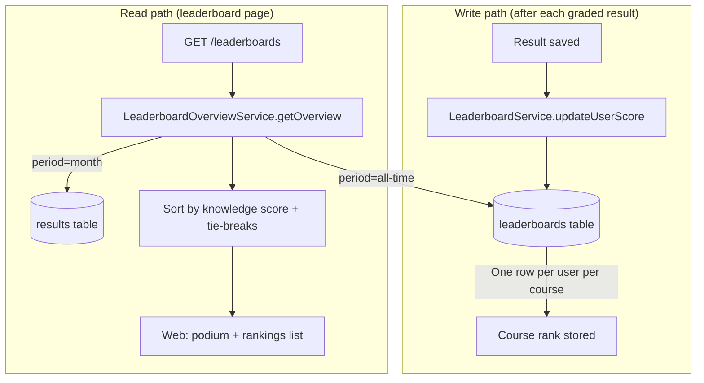
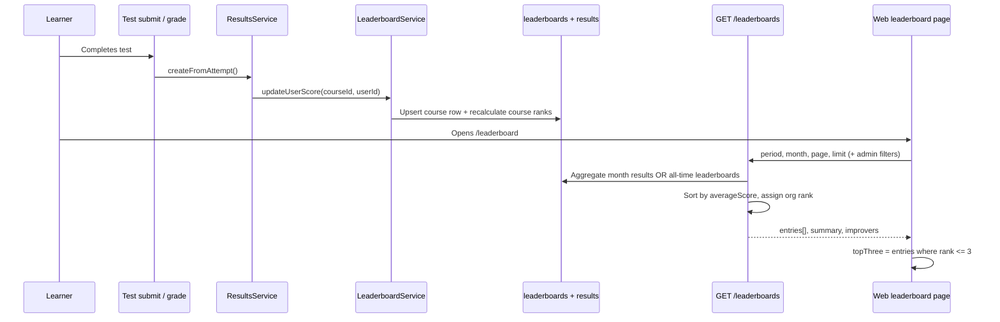

# ProTrain Leaderboard Calculations

**Status:** Reference documentation (derived from current backend + web client behaviour)  
**Date:** 8 September 2026  
**Scope:** NestJS backend (`pro-train`) and Next.js web client (`protrain-client`)

This document explains **how leaderboard data is generated**, **what it is based on**, and **how the top 3 performers are determined** — especially the org-wide view that includes **all branches**.

---

## 1. Executive summary

| Question | Answer |
|---|---|
| **What primarily determines rank?** | **Knowledge score** — the learner’s **average test percentage** (`averageScore`). Higher average wins. |
| **What is “knowledge score”?** | Mean of test **percentages** in the selected period. On the web UI this is labelled “Avg score” and shown as `%`. |
| **Are ranks based on tests passed?** | **No.** `testsCompleted` (count of graded results) is a **tie-breaker only**, not the primary sort. |
| **Are ranks based on total points?** | **Partially.** `totalPoints` (sum of raw `result.score`) is the **second tie-breaker** after tests completed. It is also displayed prominently on the podium. |
| **Is XP used?** | **No.** XP / rewards (`user_rewards.totalXP`) is a **separate ranking system** and is not merged into the test leaderboard. |
| **Who appears on the board?** | Active learners only: users with role `user` in the org. Admins/owners are excluded from rankings. |
| **Default scope for learners** | **Org-wide, all branches** — not limited to the learner’s own branch. |
| **How is top 3 chosen?** | Backend sorts all eligible learners, assigns `rank` 1…N. The web client takes **page 1 entries where `rank <= 3`**. |
| **Default period on web** | **This month** (`period=month`, current UTC month). |

**Bottom line:** the podium and org leaderboard are **knowledge-score rankings** (average test performance), with volume and raw points used only to break ties. They are **not** “most tests passed” or “most XP earned” leaderboards.

---

## 2. Architecture — two related systems

ProTrain has **two layers** of leaderboard logic that work together.



### 2.1 Course leaderboard table (`leaderboards`)

**Entity:** `src/leaderboard/entities/leaderboard.entity.ts`  
**Service:** `src/leaderboard/leaderboard.service.ts`

- **Granularity:** one stored row per **(courseId, userId)**.
- **Updated when:** a result is graded (`ResultsService` → `updateUserScore`).
- **Stored fields:**

| Field | Meaning |
|---|---|
| `rank` | Position within **that course** only |
| `averageScore` | Mean of `result.score` for that user in that course (0–100 scale) |
| `testsCompleted` | Count of results for that user in that course |
| `totalPoints` | Sum of `result.score` for that user in that course |
| `lastUpdated` | Last recalculation timestamp |

**Course-level rank formula (bulk rebuild):**

```
totalPoints     = Σ result.score
testsCompleted  = count(results)
averageScore    = totalPoints / testsCompleted
rank            = dense rank by averageScore DESC
```

**Incremental recalculation** (`recalculateRanks`) re-sorts with tie-break:

```
ORDER BY averageScore DESC, totalPoints DESC
```

> **Note:** Course-table writes do **not** currently filter `voidedByResetId` results. Admin/report queries often do exclude voided rows — a known inconsistency.

### 2.2 Org-wide overview API (`LeaderboardOverviewService`)

**Service:** `src/leaderboard/leaderboard-overview.service.ts`  
**Endpoints:**

| Endpoint | Purpose |
|---|---|
| `GET /leaderboards` | Org-wide rankings (default learner view) |
| `GET /leaderboards/course/:courseId` | Same overview logic, scoped to one course |

This is what powers the **web leaderboard page** (`/leaderboard`). It **aggregates across courses** (unless a course filter is applied) and **across branches** (unless an admin applies a branch filter).

---

## 3. What the leaderboard is based on

### 3.1 Primary metric — knowledge score (`averageScore`)

The API and controller describe org rankings as **“by knowledge score”**:

```typescript
// src/leaderboard/leaderboard.controller.ts
'Returns paginated org-wide rankings (all branches) by knowledge score.'
```

**Knowledge score = average test performance expressed as a percentage.**

How it is computed depends on the selected **period**:

| Period | Data source | `averageScore` SQL / logic |
|---|---|---|
| **`month`** (default) | `results` rows in the UTC calendar month | `AVG(result.percentage)` |
| **`all-time`** | Aggregated `leaderboards` rows per user | `AVG(l.averageScore)` across the user’s course entries |

Only users with **at least one qualifying result/leaderboard row** in the filtered scope appear.

### 3.2 Secondary metrics (display + tie-breakers)

| Metric | Field | Role in ranking | Role in UI |
|---|---|---|---|
| **Tests completed** | `testsCompleted` | **1st tie-breaker** after equal `averageScore` | Shown on podium and rankings list |
| **Total points** | `totalPoints` | **2nd tie-breaker** after equal tests completed | Hero number on podium; “Average points” / “Highest score” summary cards |
| **Tests passed** | *(not in overview DTO)* | **Not used** for org overview rank | Used elsewhere in admin motivational reports only |
| **XP / level** | `user_rewards` | **Not used** | Profile / rewards surfaces only |
| **Pass rate** | derived from `result.passed` | **Not used** for rank | Admin analytics |

**Total points definition:**

| Period | Calculation |
|---|---|
| `month` | `SUM(result.score)` in the month |
| `all-time` | `SUM(l.totalPoints)` across course leaderboard rows |

`result.score` is the raw points earned on a test (not the same as percentage, though both derive from the same attempt).

### 3.3 What is explicitly NOT used for org rank

- Number of tests **passed** (`result.passed = true`)
- XP, level, badges, streaks
- Training hours
- Course material views
- Leaderboard “improvers” delta (that is a separate insight panel, not rank input)

---

## 4. Ranking algorithm (org-wide)

All org-wide ranks are assigned in **`LeaderboardOverviewService.rankUsers()`** after aggregation.

### 4.1 Sort order (the criteria)

```typescript
// src/leaderboard/leaderboard-overview.service.ts — compareLeaderboardStats()
1. averageScore   DESC   ← knowledge score wins
2. testsCompleted DESC   ← more assessed activity breaks ties
3. totalPoints    DESC   ← higher cumulative raw score breaks remaining ties
```

**Example**

| Learner | Avg score | Tests | Points | Rank |
|---|---:|---:|---:|---:|
| Alice | 92% | 4 | 360 | **1** |
| Bob | 92% | 3 | 400 | **2** (same avg, fewer tests) |
| Carol | 90% | 10 | 900 | **3** (lower knowledge score despite more points) |

Carol has the most points but ranks lower because **knowledge score dominates**.

### 4.2 Rank assignment

After sorting:

```
rank = index + 1   // dense ranking (1, 2, 3, … no gaps)
```

Additional computed fields per entry:

| Field | Formula / meaning |
|---|---|
| `letterGrade` | Derived from `averageScore` (A+ at 97% down to F below 60%) |
| `achievementLevel` | `expert` ≥90, `advanced` ≥80, `intermediate` ≥70, else `beginner` |
| `percentileRank` | `round(((total - rank + 1) / total) * 100)` |
| `badges` | `champion` if rank=1; `top_performer` if rank≤3; score thresholds at 95/85 |
| `rankChange` | *(month only)* `previousRank - currentRank` |
| `pointsDelta` | *(month only)* current `totalPoints - previous month totalPoints` |

### 4.3 Summary cards (`LeaderboardSummary`)

Built from the **already ranked** list:

| Summary field | Meaning |
|---|---|
| `totalParticipants` | Count of ranked learners |
| `averagePoints` | Mean of all learners’ `totalPoints` |
| `highestScore` | **`totalPoints` of rank #1** (not their average %) |
| `averageScore` | Mean of all learners’ `averageScore` (org knowledge average) |
| `yourRank` / `yourPoints` / `yourPointsDelta` | Current user’s position and month delta |

---

## 5. Top 3 performers across all branches

### 5.1 Scope — “all branches” by design

For **learners**, the overview API is **org-wide by default**:

```typescript
// src/leaderboard/leaderboard-overview.service.ts
// Org-wide by default so Top Performers / Complete Rankings include
// every branch. Do not fall back to scope.branchId — that silently
// hid other offices from learners (often leaving only themselves).
const branchId = query.branchId; // only set when admin passes ?branchId=
```

So the **top 3 on the default leaderboard page** are the **top 3 learners in the entire organisation** (all branches), not “top 3 in my branch”.

Admins can narrow the list with **`?branchId=`** in the filter bar. Learners cannot.

### 5.2 How top 3 is selected (backend)

There is **no separate “podium” endpoint**. Top 3 is simply:

```
sort all eligible learners by knowledge score (+ tie-breaks)
→ assign rank 1, 2, 3, …
→ return paginated entries (default limit 50, page 1)
```

Badges reinforce top 3 server-side:

```typescript
if (rank === 1) badges.push('champion');
if (rank <= 3) badges.push('top_performer');
```

### 5.3 How top 3 is selected (web client)

**Page:** `protrain-client/app/leaderboard/leaderboard-page-client.tsx`  
**Podium component:** `components/leaderboard/leaderboard-podium.tsx`

```typescript
const entries = data?.entries ?? []
const topThree = entries.filter(entry => entry.rank <= 3).slice(0, 3)
```

Rules:

- Podium renders **only on page 1**.
- Client **does not re-sort** — it trusts server `rank`.
- Layout: `entries[0]` = 1st (gold), `[1]` = 2nd, `[2]` = 3rd.
- Podium hero metric = **`totalPoints`**, with **`averageScore`%** and **`testsCompleted`** as secondary stats.

### 5.4 Branch-specific top 3 (different surface)

The **learner insights panel** (`leaderboard-learner-insights.tsx`) shows a **branch leaderboard snippet**:

```
filter entries where branchName === current user's branch
→ slice(0, 3)
```

That is **client-side filtering of the org-wide result set**, not a separate API call. It can differ from the global podium if top org performers belong to other branches.

### 5.5 Admin report top 3 per branch (different system)

Admin scheduled reports use **`AdminInsightsReportsService`** with `BRANCH_TOP_PERFORMER_COUNT = 3`. That motivational report ranks by:

```
totalPoints DESC → testsPassed DESC → testsCompleted DESC → name
```

This is **not identical** to the learner-facing overview sort (which prioritises **averageScore**). Documented here because stakeholders sometimes conflate the two.

---

## 6. Period and filter behaviour

### 6.1 Periods

| `period` | Default? | Data source | Time boundary |
|---|---|---|---|
| `month` | **Yes** (web default) | `results` | UTC month from `month=YYYY-MM` (defaults to current UTC month) |
| `all-time` | No | `leaderboards` (aggregated per user) | Lifetime course rows |

Month boundaries:

```
start = UTC first day of month 00:00
end   = UTC first day of next month 00:00 (exclusive)
```

When `period=month`, the API also loads **previous month** stats for:

- `pointsDelta`, `rankChange`
- `topImprovers` (largest positive `pointsDelta`)
- `needsSupport` (negative `pointsDelta`, admin-only)

### 6.2 Other filters (admin only on web)

| Filter | Query param | Effect |
|---|---|---|
| Course | `courseId` | Restrict aggregation to one course |
| Branch | `branchId` | Restrict to one branch |
| Search | `search` | First/last name contains term |
| Active only | `activeOnly` | Activity within last 30 days |

Learners only toggle **All time / This month**.

### 6.3 Branch filter implementation differences

| Period | Branch filter matches |
|---|---|
| `all-time` | `leaderboard.branchId` **OR** `user.branchId` |
| `month` | `result.branchId` only |

This means monthly branch filtering can be stricter than all-time branch filtering.

---

## 7. End-to-end data flow



### Course-level vs org-level — important distinction

| View | Rank meaning |
|---|---|
| **`leaderboards` table** | Rank within **one course** |
| **`GET /leaderboards` overview** | Rank within **org** (optionally filtered), aggregating across courses |

The web `/leaderboard` page uses the **overview** API, not the raw per-course table reader (`LeaderboardService.getCourseLeaderboard` exists but is not wired to the main org endpoint).

---

## 8. Web UI field mapping

### 8.1 API call

```typescript
// protrain-client/services/leaderboard-service.tsx
GET /leaderboards
GET /leaderboards/course/:courseId   // when admin selects a course
```

Default params from `leaderboard-page-client.tsx`:

- `page=1`, `limit=50`
- `period=month` unless URL says `all-time`
- `month=YYYY-MM` (current UTC month)

### 8.2 Summary cards (`leaderboard-summary-cards.tsx`)

| Card | API field | Notes |
|---|---|---|
| Participants | `summary.totalParticipants` | |
| Average points | `summary.averagePoints` | Mean raw points across learners |
| Highest score | `summary.highestScore` | Rank #1’s **totalPoints**, not avg % |
| Avg score | `summary.averageScore` | Org **knowledge average** (%) |
| Your rank | `summary.yourRank` | With `yourPoints` hint |
| Your change | `summary.yourPointsDelta` | Month-over-month points delta |

### 8.3 Podium vs full list

| Surface | Primary displayed metrics |
|---|---|
| **Podium (top 3)** | `totalPoints`, `averageScore`%, `testsCompleted`, `achievementLevel`, badges |
| **Rankings list** | Above + `letterGrade`, `rankChange`, `percentileRank`, `consistencyRating`, `branchName` |

Comment in rankings list: *“org-wide list ordered by knowledge score”* — ordering is **server-side** via `averageScore`.

---

## 9. Related but separate ranking systems

Do not confuse these with the main leaderboard page.

| System | Endpoint / location | Primary sort | Used for |
|---|---|---|---|
| **XP rankings** | `GET /rewards/rankings` | `totalXP` or `challengeMonthXP` | Gamification / profile |
| **Admin performers report** | `GET /reports/admin/performers` | `AVG(result.percentage)` in timeframe | Executive reporting |
| **Admin motivational rankings** | `GET /reports/admin/leaderboard-insights` | `totalPoints`, then tests passed | Scheduled emails |
| **Legacy reports top performers** | `GET /reports/leaderboard/top-performers` | `totalPoints DESC` | Analytics dashboard |
| **Home carousel snapshot** | `HomeInsightsService` | First 3 from overview entries | Mobile/web home |

---

## 10. Edge cases and known inconsistencies

| Topic | Behaviour |
|---|---|
| **Voided / reset attempts** | Not excluded from `leaderboards` table writes; may still appear in monthly aggregation unless filtered elsewhere |
| **Tie-break mismatch** | Bulk course rebuild sorts by `averageScore` only; incremental `recalculateRanks` also uses `totalPoints` |
| **`LeaderboardFilterDto`** | Defines week/month/all-time sort options but is **not wired** to live endpoints |
| **Tests passed** | Shown in admin reports; **not** used for learner org rank |
| **Pagination vs podium** | Podium hidden when `page > 1` |
| **Minimum activity** | No minimum tests required for overview rank (unlike some admin reports that use `MIN_RESULTS_FOR_RANKING = 1` explicitly) |

---

## 11. Quick reference formulas

### Org overview rank (learner leaderboard page)

```
IF period = month:
  averageScore   = AVG(result.percentage)   for user in UTC month
  totalPoints    = SUM(result.score)
  testsCompleted = COUNT(result.resultId)

IF period = all-time:
  averageScore   = AVG(leaderboards.averageScore) per user across courses
  totalPoints    = SUM(leaderboards.totalPoints)
  testsCompleted = SUM(leaderboards.testsCompleted)

SORT users BY averageScore DESC, testsCompleted DESC, totalPoints DESC
ASSIGN rank = 1..N

TOP 3 (all branches, default) = users with rank 1, 2, 3 in org-wide sorted list
```

### Course table row (underlying all-time data)

```
Per (courseId, userId):
  totalPoints    = Σ result.score
  testsCompleted = count(results)
  averageScore   = totalPoints / testsCompleted
  courseRank     = dense rank by averageScore DESC within course
```

---

## 12. Source file index

| Concern | Path |
|---|---|
| Overview ranking logic | `pro-train/src/leaderboard/leaderboard-overview.service.ts` |
| Course table writes | `pro-train/src/leaderboard/leaderboard.service.ts` |
| API routes | `pro-train/src/leaderboard/leaderboard.controller.ts` |
| Entity | `pro-train/src/leaderboard/entities/leaderboard.entity.ts` |
| Result → leaderboard trigger | `pro-train/src/results/results.service.ts` |
| Admin branch top-3 reports | `pro-train/src/reports/services/admin-insights-reports.service.ts` |
| XP rankings (separate) | `pro-train/src/rewards/rewards.service.ts` |
| Web page orchestration | `protrain-client/app/leaderboard/leaderboard-page-client.tsx` |
| Podium UI | `protrain-client/components/leaderboard/leaderboard-podium.tsx` |
| Summary cards | `protrain-client/components/leaderboard/leaderboard-summary-cards.tsx` |
| API client | `protrain-client/services/leaderboard-service.tsx` |

---

## 13. Implications for AI features

When designing AI coaching or narrative insights (see `openai-protrain.md`):

- **“Top performer”** on the learner leaderboard means **highest knowledge score (average %)** org-wide, not most tests passed or most XP.
- **`totalPoints`** is cumulative raw score — useful context, but **secondary** to `averageScore` for rank.
- **Branch coaching** should not assume the global podium represents the learner’s branch; use branch-filtered data or the learner insights panel logic.
- **Month vs all-time** materially changes who appears and how deltas behave — always pass the same period the UI is showing.

---

*End of document.*
