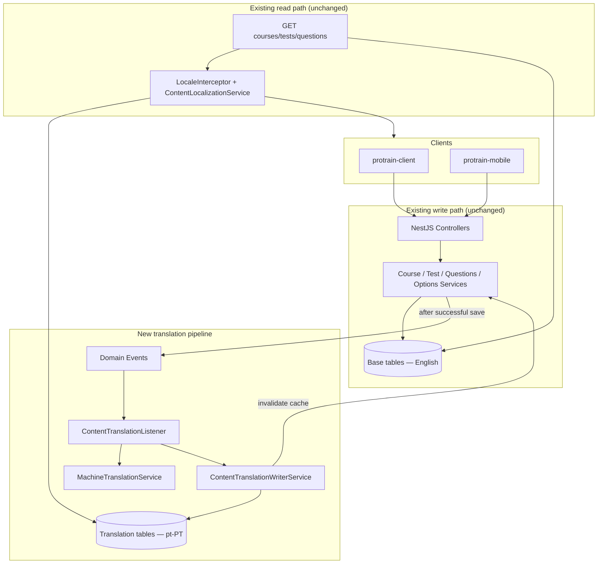

# Data Translation Functions — Automatic pt-PT Content Translation

Phased implementation plan for translating **courses, tests, questions, and question options** to **European Portuguese (`pt-PT`)** immediately after successful create/update operations.

**Related docs:** [`backend-language-change.md`](./backend-language-change.md) · [`user-language-change.md`](./user-language-change.md)

**Last updated:** 2026-08-14

---

## Table of Contents

1. [Executive Summary](#executive-summary)
2. [Current State vs Target](#current-state-vs-target)
3. [Design Principles](#design-principles)
4. [Target Architecture](#target-architecture)
5. [Translatable Fields](#translatable-fields)
6. [Phase Plan](#phase-plan)
7. [Backend Implementation Detail](#backend-implementation-detail)
8. [Web Client (`protrain-client`)](#web-client-protrain-client)
9. [Mobile App (`protrain-mobile`)](#mobile-app-protrain-mobile)
10. [Testing Strategy](#testing-strategy)
11. [Operational Concerns](#operational-concerns)
12. [File Reference](#file-reference)
13. [Completion Checklist](#completion-checklist)

---

## Executive Summary

ProTrain already supports **reading** localized content:

- English (`en`) remains the **canonical source** stored in base tables (`courses`, `tests`, `questions`, `question_options`).
- Portuguese translations live in **sidecar tables** (`course_translations`, `test_translations`, `question_translations`, `question_option_translations`).
- `ContentLocalizationService` merges `pt-PT` over English on **GET** detail endpoints when `Accept-Language: pt-PT` or `?locale=pt-PT` is resolved.

**What is missing:** when an admin creates or updates content through existing APIs, **no automatic write** occurs to the translation tables. New or edited English text is invisible to Portuguese learners until someone manually backfills translations (today via migration scripts and JSON seed files).

**This plan adds:** a backend **post-save translation pipeline** that:

1. Preserves all existing create/update business logic and HTTP contracts.
2. Runs **after** the primary entity save succeeds (and after DB transactions commit).
3. Translates changed English text fields to `pt-PT` via a machine-translation provider.
4. **Upserts** rows into the four translation tables (same pattern as `seed-pt-pt-translations.ts`).
5. Invalidates content caches so localized reads reflect new translations.

Clients **do not** send Portuguese text during authoring. Translation is entirely server-side.

---

## Current State vs Target

| Area | Today | Target |
|------|-------|--------|
| Course create/update | Saves English only | Same save + async pt-PT upsert |
| Test create (nested questions) | Single transaction, English only | Same transaction + post-commit translation job for test + all nested entities |
| Test update | `PUT /tests/:id` updates metadata only | Same + translate changed test fields |
| Question sync (web/mobile edit) | `syncTestQuestions` → separate `/questions` CRUD | Each question/option create/update triggers its own translation upsert |
| Translation storage | Manual scripts + migrations | Automatic on every successful mutation |
| Read path | Already localized | Unchanged |
| Admin UI | English authoring only | Unchanged (optional status indicator later) |

### Existing infrastructure to reuse

| Component | Path | Reuse |
|-----------|------|-------|
| Translation entities | `src/locale/entities/*-translation.entity.ts` | Write targets — no schema change required |
| Upsert SQL pattern | `src/database/seed-pt-pt-translations.ts` | Extract into shared `ContentTranslationRepository` |
| Read merge | `src/locale/content-localization.service.ts` | Unchanged |
| Locale constants | `src/locale/locale.constants.ts` | `DEFAULT_LOCALE = 'en'`, target `pt-PT` |
| Event emitter | `@nestjs/event-emitter` (already in `AppModule`) | Decouple translation from HTTP latency |
| Cache invalidation | `CourseService.invalidate*`, `TestService.invalidate*` | Call after translation upsert |

---

## Design Principles

1. **Do not change existing save semantics.** Create/update DTOs, validation, transactions, ownership checks, and response shapes stay the same. Translation is an additive side effect.

2. **English is source of truth.** Base columns are always written first. Translation never overwrites English base data.

3. **Post-commit, non-blocking.** Translation runs **after** the HTTP mutation returns success (via domain events + listener). Admin saves stay fast; learners may see English briefly until translation completes (seconds).

4. **Idempotent upserts.** Use `INSERT ... ON DUPLICATE KEY UPDATE` (or TypeORM `upsert`) keyed by `(entityId, locale)` so retries and re-saves are safe.

5. **Translate only changed fields.** On update, compare previous vs new English text (or store a content hash on the translation row) to skip unchanged fields and reduce API cost.

6. **Skip empty values.** Do not call the translation provider for `null`, empty, or whitespace-only strings.

7. **European Portuguese only.** Target locale is **`pt-PT`** (not `pt-BR`). Provider calls must specify `target: 'pt-PT'` or equivalent.

8. **Fail open for authoring, fail loud in logs.** Translation failures must **not** roll back the primary save. Log errors, increment metrics, and support manual retry.

9. **Feature-flagged rollout.** `CONTENT_AUTO_TRANSLATION_ENABLED=true` in env allows disabling in dev or during provider outages.

---

## Target Architecture



### Request flow (example: create test with questions)

```
POST /tests  →  TestService.create()
                  ├─ BEGIN TRANSACTION
                  ├─ save Test, Questions, Options (English) — unchanged
                  └─ COMMIT
                →  return 201 TestResponseDto — unchanged
                →  emit content.translate.test { testId }
                →  ContentTranslationListener (async)
                     ├─ load test + questions + options from DB
                     ├─ MachineTranslationService.translateBatch(en → pt-PT)
                     ├─ ContentTranslationWriterService.upsertAll(...)
                     └─ TestService.invalidateTestCache(...)
```

### Test edit flow (web + mobile)

Both clients follow the same pattern:

1. `PUT /tests/:id` — metadata only.
2. `syncTestQuestions()` — creates, updates, deletes questions via `/questions` and `/questions-options` APIs.

Translation hooks must exist on **each** of these endpoints, not only on composite test create. Otherwise edits after step 2 would leave stale Portuguese text.

---

## Translatable Fields

| Entity | Base table | Translation table | Fields to translate |
|--------|------------|-------------------|---------------------|
| Course | `courses` | `course_translations` | `title`, `description` |
| Test | `tests` | `test_translations` | `title`, `description` |
| Question | `questions` | `question_translations` | `questionText`, `explanation`, `hint`, `mediaInstructions` |
| Question option | `question_options` | `question_option_translations` | `optionText` |

**Out of scope (this phase):**

- Course materials (`course_materials.title`, `description`) — no translation table today.
- Media filenames, tags, difficulty enums, status labels.
- User-generated answers (`answers.textAnswer`).

**Deletion:** Translation rows cascade-delete via FK (`onDelete: 'CASCADE'` on entities). No extra work when questions/options are removed.

---

## Phase Plan

### Phase 0 — Decisions & provider setup (0.5–1 day)

**Goal:** Choose translation provider and define operational constraints.

| Task | Status |
|------|--------|
| Confirm target locale: **`pt-PT`** (already decided) | [x] |
| Select machine translation provider | [ ] |
| Add env vars to `.env-example` (never commit secrets) | [ ] |
| Define cost/rate limits (chars per month, max batch size) | [ ] |
| Confirm feature flag default per environment | [ ] |

**Recommended provider:** **Google Cloud Translation API v3** — project already uses Google Cloud Storage; single billing account, IAM service account reuse pattern.

**Alternative providers:** DeepL API, Azure Translator (acceptable if org standard differs).

**Environment variables (add to `.env-example`):**

```bash
CONTENT_AUTO_TRANSLATION_ENABLED=true
CONTENT_TRANSLATION_TARGET_LOCALE=pt-PT
CONTENT_TRANSLATION_SOURCE_LOCALE=en
GOOGLE_TRANSLATE_PROJECT_ID=          # may reuse GOOGLE_CLOUD_PROJECT_ID
# Provider-specific API key or service account — follow Security rules
CONTENT_TRANSLATION_MAX_BATCH_CHARS=30000
CONTENT_TRANSLATION_RETRY_ATTEMPTS=3
```

**Deliverable:** Provider account ready; env documented; feature flag agreed.

---

### Phase 1 — Translation write infrastructure (2–3 days)

**Goal:** Shared services for translate + upsert, independent of HTTP controllers.

#### 1.1 New module: `src/locale/translation/`

| File | Responsibility |
|------|----------------|
| `translation.module.ts` | Imports `TypeOrmModule.forFeature([...Translation entities])`, exports services |
| `machine-translation.service.ts` | Provider adapter: `translateTexts(texts: string[], from: 'en', to: 'pt-PT'): Promise<string[]>` |
| `content-translation-writer.service.ts` | Upsert course/test/question/option translation rows |
| `content-translation.types.ts` | DTOs / interfaces for batch payloads |
| `translation.constants.ts` | `TARGET_LOCALE`, batch sizes, field maps |

#### 1.2 Extend `ContentLocalizationService` (or sibling writer)

Add **write** methods mirroring read helpers:

```typescript
// Sketch — not implemented yet
upsertCourseTranslation(courseId: number, fields: CourseTranslationFields): Promise<void>;
upsertTestTranslation(testId: number, fields: TestTranslationFields): Promise<void>;
upsertQuestionTranslation(questionId: number, fields: QuestionTranslationFields): Promise<void>;
upsertOptionTranslation(optionId: number, fields: OptionTranslationFields): Promise<void>;
```

Reuse upsert SQL from `src/database/seed-pt-pt-translations.ts` — extract shared helper to avoid duplication between seed migrations and runtime writes.

#### 1.3 `MachineTranslationService` implementation notes

- Batch multiple short strings in one provider request (respect `MAX_BATCH_CHARS`).
- Preserve order mapping (input index → output index).
- HTML / markdown: translate plain text only; do not send markup tags if avoidable.
- **Never log** full question text at `debug` in production (PII/training content).
- Unit-test with mocked provider; no live API calls in CI.

#### 1.4 Optional: translation job status table (Phase 1 or defer to Phase 6)

```sql
content_translation_jobs (
  jobId PK,
  entityType ENUM('course','test','question','option'),
  entityId INT,
  locale VARCHAR(10),
  status ENUM('pending','completed','failed'),
  lastError TEXT NULL,
  sourceContentHash VARCHAR(64) NULL,
  createdAt, updatedAt
)
```

Enables admin retry UI and observability. **Can defer** if logs + manual re-trigger endpoint are enough initially.

**Deliverable:** `MachineTranslationService` + `ContentTranslationWriterService` with unit tests; no HTTP wiring yet.

---

### Phase 2 — Domain events & listener (1–2 days)

**Goal:** Wire post-save translation without modifying controller contracts.

#### 2.1 New events (`src/common/events/`)

| Event | Payload | Emitted from |
|-------|---------|--------------|
| `CourseContentSavedEvent` | `{ courseId, changedFields? }` | `CourseService.create`, `CourseService.update` |
| `TestContentSavedEvent` | `{ testId, includeQuestions?: boolean }` | `TestService.create`, `TestService.update` |
| `QuestionContentSavedEvent` | `{ questionId }` | `QuestionsService.create`, `update`, `createBulk` |
| `QuestionOptionContentSavedEvent` | `{ optionId }` | `QuestionsOptionsService.create`, `update`, `createBulk` |

Use a single event name namespace, e.g. `content.saved.course`, for consistency with existing `course.created` / `test.created` events.

**Important:** Emit events **after** transaction commit and **after** cache invalidation for the primary save (order: save → commit → invalidate primary cache → emit event → listener translates → invalidate again).

#### 2.2 Listener: `ContentTranslationListener`

Path: `src/locale/translation/content-translation.listener.ts`

```typescript
@Injectable()
export class ContentTranslationListener {
  @OnEvent('content.saved.course', { async: true })
  async handleCourseSaved(event: CourseContentSavedEvent): Promise<void> { ... }

  @OnEvent('content.saved.test', { async: true })
  async handleTestSaved(event: TestContentSavedEvent): Promise<void> { ... }

  // question + option handlers ...
}
```

Listener responsibilities:

1. Check `CONTENT_AUTO_TRANSLATION_ENABLED`.
2. Load current English fields from DB (source of truth post-save).
3. On update: optionally skip if `sourceContentHash` unchanged.
4. Call `MachineTranslationService` for non-empty fields.
5. Call `ContentTranslationWriterService.upsert*`.
6. Invalidate localized content caches (`courseId`, `testId`, etc.).
7. Catch errors — log + optional job status `failed`; **do not throw** to event bus.

Register listener in `TranslationModule` or `LocaleModule`.

**Deliverable:** End-to-end translation on event emit in dev/staging with feature flag on.

---

### Phase 3 — Service integration (2–3 days)

**Goal:** Emit events from existing create/update methods without refactoring their core logic.

#### 3.1 `CourseService`

| Method | Change |
|--------|--------|
| `create()` | After `courseRepository.save` + success response path, emit `CourseContentSavedEvent` |
| `update()` | After save; pass `changedFields` if title/description mutated |

**No changes to:** DTOs, ownership validation, materials loop, `CourseCreatedEvent` (keep for email/rewards).

#### 3.2 `TestService`

| Method | Change |
|--------|--------|
| `create()` | After transaction **commit**, emit `TestContentSavedEvent { testId, includeQuestions: true }` |
| `update()` | After save, emit `TestContentSavedEvent { testId, includeQuestions: false }` |

**No changes to:** transaction structure, question creation loop, `TestCreatedEvent`, exam window logic.

When `includeQuestions: true`, listener loads all questions + options for `testId` and translates in one job (efficient batching).

#### 3.3 `QuestionsService`

| Method | Change |
|--------|--------|
| `create()` | Emit `QuestionContentSavedEvent` + translate nested options if created inline |
| `createBulk()` | Emit one event per question after commit (or single `TestContentSavedEvent` with `testId`) |
| `update()` | Emit `QuestionContentSavedEvent` when text fields change |
| `createQuestionInTransaction()` | Used by bulk — ensure event fires **after** outer transaction commits |

Also emit option events when options are created/updated as part of question flows.

#### 3.4 `QuestionsOptionsService`

| Method | Change |
|--------|--------|
| `create()` / `createBulk()` / `update()` | Emit `QuestionOptionContentSavedEvent` |

#### 3.5 Cache invalidation

After translation upsert, invalidate the same keys as primary save:

- `CourseService.invalidateCourseCache`, `invalidateCourseListCachesForCourse`
- `TestService.invalidateTestCache`
- Question caches if applicable

This ensures the next `GET ?locale=pt-PT` returns fresh Portuguese text.

**Deliverable:** All admin write paths produce pt-PT rows automatically.

---

### Phase 4 — Change detection & cost optimization (1 day)

**Goal:** Avoid re-translating unchanged English on every save.

| Approach | Implementation |
|----------|----------------|
| Field-level diff | Compare `previous.title !== next.title` before emitting event |
| Content hash | SHA-256 of concatenated translatable fields stored on translation row or job table |
| Partial upsert | Only update translation columns that changed |

Apply in listener or at emit site. **Status-only updates** (e.g. `{ status: 'active' }` from mobile) must **not** trigger translation.

**Deliverable:** Translation API calls only when English text actually changes.

---

### Phase 5 — Admin retry & observability (1–2 days, optional but recommended)

**Goal:** Recover from provider failures without re-running migrations.

| Item | Action |
|------|--------|
| `POST /admin/translations/retry` | Accept `{ entityType, entityId }` — re-run translation for one entity |
| `GET /admin/translations/status/:entityType/:entityId` | Return last job status / missing fields |
| Structured logging | `translation.completed`, `translation.failed` with entity ids |
| Metrics | Count chars translated, latency, error rate |

Guard with admin role (`RolesGuard` / org admin).

**Deliverable:** Operators can retry failed translations without DB scripts.

---

### Phase 6 — Web client (`protrain-client`) (0.5–1 day)

**Goal:** Minimal changes — authoring stays English; UX optionally reflects async translation.

#### Required changes: **none** for core functionality

Existing flows already work:

- `components/courses/course-form.tsx` → `useCreateCourse` / `useUpdateCourse`
- `components/tests/test-form.tsx` → `createTest` / `updateTest` + `syncTestQuestions`
- `lib/test-question-form-utils.ts` → question CRUD

Backend handles translation after success. **Do not** add `translations` blocks to request payloads unless manual override is added later.

#### Recommended enhancements (optional)

| Item | Action | Priority |
|------|--------|----------|
| Success toast copy | Add i18n key: "Content saved. Portuguese translation is being generated." | P2 |
| React Query invalidation delay | After save, optionally refetch test/course detail after ~2s when user locale is `pt-PT` | P3 |
| Admin translation status badge | On test/course detail, show "PT translation: pending / ready / failed" from status API | P3 |
| Document upload → create test | `document-upload-page.tsx` `createTestFromQuiz` — no change; backend translates parsed English | — |

#### Testing (web)

- Create course in EN UI → switch to PT → verify title/description localize within reasonable time.
- Edit test question → verify updated PT text on next fetch.
- Confirm **no regression** in `syncTestQuestions` delete/create/update sequencing.

**Deliverable:** Web admin workflow unchanged; optional UX polish documented.

---

### Phase 7 — Mobile app (`protrain-mobile`) (0.5 day)

**Goal:** Same as web — **no required client changes** for translation to work.

Admin create/edit already calls the same APIs:

| Flow | Path |
|------|------|
| Create/update test | `src/services/admin-test-service.ts` |
| Sync questions after update | `src/utils/test-question-form-utils.ts` → `syncTestQuestions` |
| Question CRUD | `src/services/question-service.ts` |
| Course updates | Course admin screens (if present) via existing services |

#### Optional mobile enhancements

| Item | Action | Priority |
|------|--------|----------|
| Admin toast after save | "Translation to Portuguese is processing" | P3 |
| Learner cache | React Query invalidation on training/test screens when locale is `pt-PT` | P3 |

**Note:** Mobile learner i18n (`Accept-Language` header) may still be incomplete per `backend-language-change.md`. Auto-translation benefits mobile learners **as soon as** mobile sends `Accept-Language: pt-PT` on content GETs — no mobile code required for the write path.

**Deliverable:** Mobile admin saves trigger backend translation identically to web.

---

### Phase 8 — Testing, QA & rollout (2–3 days)

See [Testing Strategy](#testing-strategy) below.

**Rollout sequence:**

1. Enable flag in **staging** only.
2. Create pilot course + test; verify all four translation tables populated.
3. Enable in production for pilot org.
4. Monitor translation error logs and provider billing.

---

## Backend Implementation Detail

### NestJS patterns to follow

| Practice | Application |
|----------|-------------|
| **Single responsibility** | `MachineTranslationService` = provider only; writer = DB only; listener = orchestration |
| **Async events** | `@OnEvent(..., { async: true })` so listeners don't block event emitter callers |
| **Injectable config** | `@nestjs/config` for feature flag and provider credentials |
| **Strict typing** | No `any`; explicit interfaces for batch translate input/output |
| **Unit tests** | Mock provider + mock repositories; AAA pattern |
| **Integration tests** | Optional e2e with provider stubbed via env `CONTENT_TRANSLATION_PROVIDER=noop` |
| **StandardResponse** | Retry/status admin endpoints return existing envelope |

### Provider adapter interface

```typescript
export interface TranslationProvider {
  translateBatch(params: {
    texts: readonly string[];
    sourceLocale: 'en';
    targetLocale: 'pt-PT';
  }): Promise<readonly string[]>;
}

@Injectable()
export class MachineTranslationService implements TranslationProvider {
  // Google Cloud Translation implementation
}

@Injectable()
export class NoopTranslationService implements TranslationProvider {
  // Returns input unchanged — for tests / disabled environments
}
```

Register real vs noop implementation based on `CONTENT_AUTO_TRANSLATION_ENABLED`.

### Upsert pattern (reuse from seed helper)

Mirror `seed-pt-pt-translations.ts`:

```sql
INSERT INTO course_translations (courseId, locale, title, description)
VALUES (?, 'pt-PT', ?, ?)
ON DUPLICATE KEY UPDATE
  title = VALUES(title),
  description = VALUES(description),
  updatedAt = CURRENT_TIMESTAMP(6)
```

TypeORM alternative: `repository.upsert(row, ['courseId', 'locale'])` if supported for MySQL unique constraints.

### Interaction with existing seed migrations

- **Historical backfill** (`1741300000000-BackfillAllPtPtTranslations.ts`) remains valid for legacy content.
- **New content** is populated at runtime; no migration needed per create.
- Manual script path (`scripts/build-pt-pt-translations.js`) remains for **bulk rewording** or provider-free corrections.

---

## Web Client (`protrain-client`)

### Files touched by admin save (reference — no structural change required)

| File | Role |
|------|------|
| `components/courses/course-form.tsx` | Course create/update |
| `components/tests/test-form.tsx` | Test create/update + question sync |
| `lib/test-question-form-utils.ts` | Question create/update/delete sync |
| `services/test-service.ts` | API calls |
| `hooks/courses/use-courses.ts` | Course mutations |
| `components/document-processing/document-upload-page.tsx` | Quiz import → create test |

### Optional new files (Phase 6 enhancements)

| File | Purpose |
|------|---------|
| `services/translation-status-service.ts` | Poll admin translation status API |
| `hooks/use-translation-status.ts` | React Query hook for badge |

### React best practices

- Keep mutations unchanged; don't block UI on translation completion.
- If adding status polling, use `refetchInterval` with backoff and unmount cleanup.
- Toast messages via `react-i18next` keys in `public/locales/*/translation.json`.

---

## Mobile App (`protrain-mobile`)

### Files touched by admin save (reference)

| File | Role |
|------|------|
| `src/components/admin/test-form-modal.tsx` | Test create/edit |
| `src/utils/test-question-form-utils.ts` | `syncTestQuestions` |
| `src/services/admin-test-service.ts` | Test CRUD |
| `src/services/question-service.ts` | Question / option CRUD |

### Mobile impact summary

| Category | Changes required |
|----------|------------------|
| Admin test/course save | **None** |
| Learner test-taking | **None** (already consumes localized GET if `Accept-Language` sent) |
| Types / DTOs | **None** |
| Optional UX | Toast or status badge only |

---

## Testing Strategy

### Unit tests (backend)

| Suite | Cases |
|-------|-------|
| `MachineTranslationService` | Batch split, empty skip, provider error propagation |
| `ContentTranslationWriterService` | Upsert idempotency, partial field update |
| `ContentTranslationListener` | Feature flag off → no-op; flag on → writer called |
| Change detection | Status-only update → no emit |

### Integration tests

| Scenario | Assert |
|----------|--------|
| Create course | Row in `course_translations` with `locale = pt-PT` |
| Update course title | Translation title updated; description unchanged if not edited |
| Create test with 2 questions + options | Rows in all four tables |
| Update single question via API | Only that question's translation row updates |
| Delete question | Translation row cascade-deleted |
| Provider failure | Base row saved; listener logs error; retry endpoint fixes |

### Manual QA checklist

#### Backend

- [ ] `POST /courses` → `course_translations` populated within ~30s
- [ ] `PUT /courses/:id` title change → translation title updates
- [ ] `PUT /courses/:id` `{ status: 'active' }` only → **no** translation API call
- [ ] `POST /tests` with nested questions → all translation tables populated
- [ ] `PUT /tests/:id` + question sync (web/mobile flow) → new/edited questions translated
- [ ] `GET /tests/:id?locale=pt-PT` returns Portuguese after job completes
- [ ] Feature flag `false` → saves succeed, no new translation rows
- [ ] Retry admin endpoint re-processes failed entity

#### Web client

- [ ] Create test in English UI → switch locale to PT → content appears in Portuguese
- [ ] Edit question text → PT version updates after refresh
- [ ] No change to form validation or submit payloads

#### Mobile

- [ ] Admin create test from mobile → same PT availability as web
- [ ] `syncTestQuestions` after edit → translations updated

#### Grading (regression)

- [ ] Multiple choice still submits `selectedOptionId` — scores unchanged in PT locale
- [ ] True/false uses option IDs, not translated label text

---

## Operational Concerns

| Topic | Guidance |
|-------|----------|
| **Latency** | Admin sees success immediately; PT may lag 1–30s depending on batch size |
| **Cost** | Log character counts; batch strings; skip unchanged fields |
| **Rate limits** | Exponential backoff in listener; respect provider quotas |
| **Security** | API keys in env only; never expose provider credentials to clients |
| **PII** | Training content may be sensitive — use enterprise translation API terms |
| **Quality** | Machine translation for first pass; admins can manually edit seed JSON for corrections until manual override UI exists |
| **Monitoring** | Alert on `translation.failed` rate > threshold |

---

## File Reference

### Backend — existing (read path)

| Purpose | Path |
|---------|------|
| Locale module | `src/locale/locale.module.ts` |
| Read merge service | `src/locale/content-localization.service.ts` |
| Translation entities | `src/locale/entities/` |
| Seed upsert helper | `src/database/seed-pt-pt-translations.ts` |
| Course writes | `src/course/course.service.ts` |
| Test writes | `src/test/test.service.ts` |
| Question writes | `src/questions/questions.service.ts` |
| Option writes | `src/questions_options/questions_options.service.ts` |

### Backend — to add

| Purpose | Path |
|---------|------|
| Translation module | `src/locale/translation/translation.module.ts` |
| Provider adapter | `src/locale/translation/machine-translation.service.ts` |
| DB writer | `src/locale/translation/content-translation-writer.service.ts` |
| Event listener | `src/locale/translation/content-translation.listener.ts` |
| Domain events | `src/common/events/content-*.event.ts` |
| Admin retry controller (optional) | `src/locale/translation/translation-admin.controller.ts` |
| Unit tests | `src/locale/translation/*.spec.ts` |

### Web client

| Purpose | Path |
|---------|------|
| Course form | `components/courses/course-form.tsx` |
| Test form | `components/tests/test-form.tsx` |
| Question sync | `lib/test-question-form-utils.ts` |
| Locale provider | `components/providers/locale-provider.tsx` |

### Mobile

| Purpose | Path |
|---------|------|
| Test form modal | `src/components/admin/test-form-modal.tsx` |
| Question sync | `src/utils/test-question-form-utils.ts` |
| Admin test service | `src/services/admin-test-service.ts` |

---

## Completion Checklist

Track implementation progress:

| Phase | Description | Status |
|-------|-------------|--------|
| 0 | Provider & env decisions | [ ] |
| 1 | Translation write infrastructure | [ ] |
| 2 | Domain events & async listener | [ ] |
| 3 | Course/Test/Question/Option service integration | [ ] |
| 4 | Change detection & cost optimization | [ ] |
| 5 | Admin retry & observability | [ ] |
| 6 | Web client optional UX | [ ] |
| 7 | Mobile optional UX | [ ] |
| 8 | QA & production rollout | [ ] |

---

## Summary

Automatic Portuguese translation is a **backend-only write-side enhancement** layered on top of the completed read-side localization system. Existing create/update flows in `CourseService`, `TestService`, `QuestionsService`, and `QuestionsOptionsService` remain unchanged in structure; they gain **post-commit domain events** that trigger machine translation and upsert into the existing four translation tables.

**Web and mobile clients require no mandatory changes** — they continue authoring in English and consuming localized content via `Accept-Language: pt-PT`. Optional UI improvements (translation pending toasts, status badges) can follow in later phases.

Implement **Phases 0–3** for minimum viable auto-translation; **Phases 4–5** for production hardening; **Phases 6–7** for admin UX polish.
