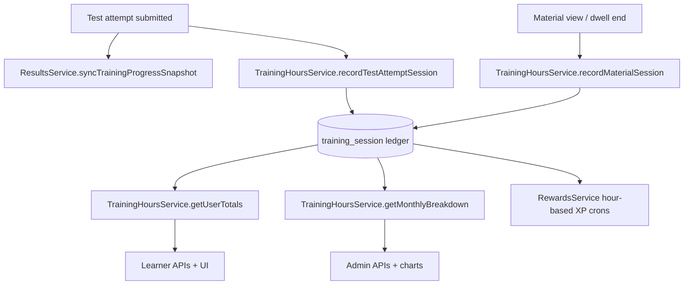

# ProTrain training hours — setup and implementation plan

This document describes how to introduce **training hours tracking and calculation** in ProTrain. It is tailored to the existing LMS backend (`pro-train`) and the Next.js client (`protrain-client`) only.

**Business goal:** Owners and admins need to see how much time learners spend on the platform — **lifetime totals** and **monthly breakdowns** — alongside existing completion and XP metrics. Learners should see their own totals to stay motivated.

---

## Overview

Training hours measure **active learning time** on ProTrain: time spent in test attempts, reviewing course materials, and (optionally) reading content between interactions. Hours are **not** the same as XP or leaderboard points:

| Metric | What it measures | Primary store today |
|--------|------------------|---------------------|
| **Training hours** | Wall-clock or active time on platform | Partially in `training_progress`, `test_attempts` |
| **XP** | Gamification rewards for behaviours | `user_rewards`, `xp_transaction` |
| **Leaderboard points** | Test score performance | `leaderboards` (derived from `results`) |

The implementation should produce **one authoritative hours ledger** so admin reports, learner dashboards, and XP hour-based goals all read the same numbers.

### Current ProTrain state (as of implementation)

| Area | Status |
|------|--------|
| Per-test time snapshots | **Partial** — `training_progress.timeSpentMinutes` updated on scored results |
| Session boundaries | **Exists** — `test_attempts.startTime`, `submitTime` |
| Per-question time | **Captured but unused** — `answers.timeSpent` (seconds, client-reported) |
| Material viewing | **Timestamp only** — `course_material_view.viewedAt` (no duration) |
| **Training session ledger** | **Implemented** — `training_session` table + `TrainingHoursModule` |
| **Monthly rollups** | **Implemented** — `user_training_hours_monthly` (upserted on session write) |
| **Training hours API** | **Implemented** — `/training-hours/*` learner + admin endpoints |
| User analytics API | **Updated** — `totalStudyTimeHours` sourced from ledger via `UserReportsService` |
| Progress stats API | **Unchanged** — frontend uses `/training-hours/me/summary` for authoritative totals |
| Frontend display | **Implemented** — home, training progress, profile, admin cards, employee analytics |
| Admin employee metrics | **Updated** — hours KPIs + org monthly trend chart |
| XP hour-based goals | **Implemented** — daily / weekly / monthly crons + new XP actions |
| Material dwell tracking | **Not implemented** — deferred to a follow-up |

Primary learner flow today:

```
startAttempt → answer questions (optional timeSpent per answer)
            → submitAttempt → autoMark → createFromAttempt
            → syncTrainingProgressSnapshotForAttempt (timeSpentMinutes from attempt wall-clock)
            → processTestResultXp()
```

Material flow:

```
POST /course-materials/:id/view → course_material_view row → VIEW_COURSE_MATERIAL XP (first view only)
```

---

## How training hours should be defined

### Recommended definition

**Training hours** = sum of **completed learning session durations** attributed to a user within an organization (and optionally branch), measured in **minutes** internally and displayed as **hours** (1 decimal place) in the UI.

A **learning session** is a bounded interval with:

- `userId`, `orgId`, optional `branchId`
- `sessionType`: `test_attempt` | `course_material` | `passive_reading` (optional Phase 2)
- `sourceId`: attempt ID, material ID, etc.
- `startedAt`, `endedAt`
- `durationMinutes`: computed, stored for query performance
- `activityDate`: UTC date used for daily/monthly grouping (typically `endedAt` date)

### What counts as training time

| Activity | Include? | How to measure |
|----------|----------|----------------|
| Submitted test attempt | **Yes** | `submitTime − startTime`, capped by test `durationMinutes` if set |
| Expired attempt (partial work) | **Yes (partial)** | `expiresAt − startTime` or last answer timestamp |
| In-progress attempt (abandoned) | **Optional Phase 2** | Heartbeat or `updatedAt − startTime` with idle timeout |
| Course material view | **Yes (Phase 2)** | Minimum 1 min on first view; optional dwell timer for PDF/video |
| Daily login / profile edit | **No** | Engagement only — not training |
| Admin authoring (create course/test) | **No for learner hours** | Could be separate “authoring time” report later |

### Caps and anti-abuse rules

Apply these server-side when recording sessions:

1. **Per-attempt cap:** `durationMinutes = min(elapsed, test.durationMinutes ?? 120)` — prevents leaving a tab open indefinitely.
2. **Minimum threshold:** Ignore sessions under **1 minute** (reduce noise from accidental clicks).
3. **Idle timeout (Phase 2):** If using client heartbeats, stop counting after **5 minutes** without interaction.
4. **Retakes:** Each submitted attempt is its **own session** — retakes add hours (learners genuinely spend time). The per-test `training_progress.timeSpentMinutes` snapshot should store **latest attempt duration** for progress context, while the **hours ledger sums all sessions**.
5. **Idempotency:** One ledger row per `(sessionType, sourceId)` — replays/backfills must not duplicate.

### Known inconsistency to fix

Today two APIs compute “study time” differently:

| Source | Calculation | Retake behaviour |
|--------|-------------|------------------|
| `TrainingProgressService.getProgressStats()` | Sum of `training_progress.timeSpentMinutes` per test | Latest attempt only per test |
| `UserReportsService.getUserAnalytics()` | `SUM(TIMESTAMPDIFF(startTime, submitTime))` on all submitted attempts | **All attempts counted** |

**Recommendation:** Introduce `training_session` as the single source of truth. Point both APIs (and new monthly endpoints) at aggregated ledger data.

---

## Architecture

### High-level data flow



### New module: `TrainingHoursModule`

Suggested location: `src/training-hours/`

```
src/training-hours/
├── training-hours.module.ts
├── training-hours.controller.ts
├── training-hours.service.ts
├── training-hours-cron.service.ts      # optional nightly rollup refresh
├── entities/
│   ├── training-session.entity.ts      # append-only session ledger
│   └── user-training-hours-monthly.entity.ts  # optional materialized rollup
├── dto/
│   ├── training-session-response.dto.ts
│   ├── user-training-hours-summary.dto.ts
│   ├── monthly-training-hours.dto.ts
│   └── admin-training-hours-analytics.dto.ts
└── constants/
    └── training-hours.constants.ts     # caps, minimums, idle timeout
```

Register in `AppModule` and export `TrainingHoursService` for use by `ResultsModule`, `CourseMaterialsModule`, and `RewardsModule`.

---

## Step-by-step implementation plan

### Phase 1 — Foundation (database + constants) ✅ COMPLETED

> **Completed:** 2026-06-30 — constants, entities, migration, backfill script. Run migration before use: `yarn typeorm:migration:run`.

1. ✅ **Create constants file**  
   `src/training-hours/constants/training-hours.constants.ts`

   ```typescript
   export const TRAINING_HOURS = {
     MIN_SESSION_MINUTES: 1,
     DEFAULT_MAX_ATTEMPT_MINUTES: 120,
     IDLE_TIMEOUT_MINUTES: 5,
     MINUTES_PER_HOUR: 60,
   } as const;

   export const TRAINING_SESSION_TYPES = {
     TEST_ATTEMPT: 'test_attempt',
     COURSE_MATERIAL: 'course_material',
   } as const;
   ```

2. ✅ **Create `training_session` entity**  
   `src/training-hours/entities/training-session.entity.ts`

   | Column | Type | Notes |
   |--------|------|-------|
   | `id` | UUID PK | |
   | `userId` | UUID FK → users | indexed |
   | `orgId` | FK → organizations | required, indexed |
   | `branchId` | FK → branches | optional |
   | `sessionType` | enum | `test_attempt`, `course_material` |
   | `sourceId` | string | attempt ID or material ID |
   | `courseId` | int | optional, denormalized for reports |
   | `startedAt` | timestamp | |
   | `endedAt` | timestamp | |
   | `durationMinutes` | int | stored computed value |
   | `activityDate` | date | UTC date for grouping |
   | `metadata` | JSON | optional: `{ capped: true, rawMinutes: 95 }` |
   | `createdAt` | timestamp | |

   **Unique constraint:** `(sessionType, sourceId)` — one ledger entry per attempt/material session.

3. ✅ **Create optional monthly rollup entity**  
   `src/training-hours/entities/user-training-hours-monthly.entity.ts`

   | Column | Type | Notes |
   |--------|------|-------|
   | `id` | UUID PK | |
   | `userId` | UUID | |
   | `orgId` | FK | |
   | `branchId` | FK | optional |
   | `yearMonth` | char(7) | `'2026-06'` |
   | `totalMinutes` | int | sum for month |
   | `sessionCount` | int | |
   | `updatedAt` | timestamp | |

   **Unique:** `(userId, orgId, yearMonth)`.

   Use rollups for fast admin dashboards; recompute from `training_session` nightly or on write (upsert).

4. ✅ **TypeORM migration**  
   File: `src/migrations/1740200000000-CreateTrainingSessionTables.ts`

   ```bash
   yarn typeorm:migration:run
   ```

5. ✅ **Backfill script**  
   `src/scripts/backfill-training-sessions-from-attempts.ts`

   ```bash
   yarn script:backfill-training-sessions
   ```

---

### Phase 2 — Core service + recording hooks ✅ COMPLETED

> **Completed:** 2026-06-30 — `TrainingHoursService`, `ResultsService` hook, `UserReportsService` ledger integration. Material dwell deferred.

6. ✅ **Implement `TrainingHoursService`** — `src/training-hours/training-hours.service.ts` (includes logging on success/failure)

   Key methods:

   | Method | Purpose |
   |--------|---------|
   | `recordTestAttemptSession(attempt: TestAttempt)` | Called after scoring; computes capped duration, upserts ledger row |
   | `recordMaterialSession(params)` | Phase 2 — material dwell time |
   | `getUserSummary(userId, orgId)` | `{ totalMinutes, totalHours, sessionCount, lastActivityAt }` |
   | `getMonthlyBreakdown(userId, orgId, from, to)` | Array of `{ yearMonth, totalMinutes, totalHours }` |
   | `getOrgMonthlyTotals(orgId, yearMonth, branchId?)` | Admin aggregate |
   | `getOrgUserRankings(orgId, yearMonth, limit)` | Top learners by hours |
   | `rebuildMonthlyRollup(userId, yearMonth)` | Maintenance / backfill |

   Duration helper (mirror existing logic in `ResultsService`):

   ```typescript
   computeAttemptDurationMinutes(attempt: TestAttempt, maxMinutes?: number): number {
     const end = attempt.submitTime ?? attempt.updatedAt;
     const elapsedMs = Math.max(0, end.getTime() - attempt.startTime.getTime());
     const rawMinutes = Math.round(elapsedMs / 60000);
     const cap = maxMinutes ?? TRAINING_HOURS.DEFAULT_MAX_ATTEMPT_MINUTES;
     return Math.min(Math.max(rawMinutes, 0), cap);
   }
   ```

7. ✅ **Hook into `ResultsService`** — non-blocking `recordTestAttemptSession()` after progress sync

8. ⏳ **Hook into material views (deferred)** — not implemented; `POST /training-hours/material-session` reserved for follow-up

9. ✅ **Deprecate duplicate calculations (partial)** — `UserReportsService` uses ledger for `totalStudyTimeHours`; frontend reads `/training-hours/me/summary` for display totals

---

### Phase 3 — API endpoints ✅ COMPLETED (core)

> **Completed:** 2026-06-30 — `TrainingHoursController`, admin employee metrics extension. Report cache + some analytics extensions deferred.

10. ✅ **Create `TrainingHoursController`** — `src/training-hours/training-hours.controller.ts` (material-session endpoint deferred)

11. ✅ **Extend existing report endpoints (partial)**

    | Endpoint | Status |
    |----------|--------|
    | `GET /reports/users/:userId/analytics` | ✅ `totalStudyTimeHours` from ledger |
    | `GET /results/admin/employee-metrics` | ✅ hours KPIs + `orgTrainingHoursTrend` |
    | `GET /reports/training-progress/:userId/analytics` | ⏳ `hoursByCourse[]` deferred |
    | `GET /reports/training-progress/global-stats` | ⏳ org-wide hours deferred |

12. ⏳ **Caching** — deferred; queries run live (acceptable for initial rollout)

13. ✅ **Swagger** — DTOs documented with `@ApiProperty`

---

### Phase 4 — XP integration ✅ COMPLETED

> **Completed:** 2026-06-30 — hour-based XP actions, evaluators, crons, sign-in `trainingHoursSummary`.

#### New XP actions — added to `xp.constants.ts` ✅

#### Implementation in `RewardsService` ✅

- `evaluateWeeklyTrainingHourGoals()` — Monday 05:30 UTC
- `evaluateMonthlyTrainingHourGoals()` — 1st of month 06:00 UTC
- `evaluateDailyTrainingGoals()` — daily 04:30 UTC

#### Sign-in payload ✅

`AuthService.loadSignInTrainingHoursSummary()` → `trainingHoursSummary` on sign-in response.

---

### Phase 5 — Frontend (protrain-client) ✅ COMPLETED

> **Completed:** 2026-06-30 — service, hooks, stat cards, profile dropdown, admin employee chart.

#### 5.1 Types and service layer ✅

- `lib/api-types.ts` — training hours interfaces
- `services/training-hours-service.ts`
- `types/api.ts` — `TrainingHoursSignInSummary`

#### 5.2 TanStack Query hooks ✅

- `hooks/training-hours/use-training-hours.ts`

#### 5.3 Display locations ✅

| Location | Component | Status |
|----------|-----------|--------|
| `/training-progress` | `ProgressStatsCards` | ✅ ledger totals + month sub-label |
| Home `/` | `UserStatisticsCard` | ✅ training hours tile |
| Home `/` admin | `AdminStatisticsCards` | ✅ org monthly hours KPI |
| Profile dropdown | `user-profile-dropdown.tsx` | ✅ hours beside XP |
| `/admin/results` | `AdminEmployeeAnalytics` | ✅ KPIs + org bar chart |

#### 5.4 UI components ✅

Integrated into existing components; standalone `monthly-training-hours-chart.tsx` not required (chart inline in admin analytics).

#### 5.5 Material dwell tracking ⏳ deferred

---

### Phase 6 — Admin charts ✅ COMPLETED (integrated)

Org monthly bar chart integrated in `components/admin/admin-employee-analytics.tsx` via `orgTrainingHoursTrend` from employee metrics API.

| Chart need | Existing ProTrain reference | New implementation |
|------------|------------------------------|-------------------|
| **Org total hours by month** | `components/courses/course-management-dashboard.tsx` — grouped `BarChart` for course popularity | `MonthlyTrainingHoursChart` — X: month, Y: total hours, secondary series: active learners |
| **Hours per employee** | `components/admin/admin-employee-analytics.tsx` — line/bar charts for pass trends and course breakdowns | `EmployeeTrainingHoursChart` — X: employee name, Y: hours; filter: current month / last 30 days / YTD |
| **Trend over time** | `components/tests/test-management.tsx` — performance trend `AreaChart` with date filters | `TrainingHoursTrendChart` — `AreaChart` with period toggle |
| **Admin KPI row** | `components/cards/admin-statistics-cards.tsx` — org-wide stat tiles on the home page | Extend with **Hours this month**, **Avg hours / learner**, **MoM % change** |

#### Recommended chart for admin owners

**Primary: “Organization training hours by month” (stacked or grouped bar chart)**

- **X-axis:** Last 12 calendar months (`2025-07` … `2026-06`)
- **Y-axis:** Total training hours (org-scoped)
- **Series 1:** Total hours (bars)
- **Series 2 (line overlay):** Active learners (users with ≥1 session that month)
- **Card actions:** Month range select, branch filter (if multi-branch)

**Secondary: “Top learners by hours” (horizontal bar chart)**

- Current month, top 10 users by `totalMinutes`
- Click through to user detail / employee metrics

**Data source:** `GET /training-hours/admin/monthly-trends?months=12`

Chart shell (match existing ProTrain admin charts):

```tsx
<Card className="@container/card">
  <CardHeader>
    <CardTitle>Training hours</CardTitle>
    <CardDescription>Organization-wide learning time by month</CardDescription>
    <CardAction>{/* month range Select */}</CardAction>
  </CardHeader>
  <CardContent>
    <ChartContainer config={chartConfig} className="aspect-auto h-[280px] w-full">
      <BarChart data={monthlyTrends}>...</BarChart>
    </ChartContainer>
  </CardContent>
</Card>
```

Include loading skeleton, empty state (`no-data-state-chart.tsx`), and error state (`error-state-chart.tsx`) — same as other admin analytics pages.

---

## Calculation reference

### Test attempt session

```
rawMinutes = round((submitTime - startTime) / 60000)
cappedMinutes = min(rawMinutes, test.durationMinutes ?? DEFAULT_MAX_ATTEMPT_MINUTES)
durationMinutes = cappedMinutes >= MIN_SESSION_MINUTES ? cappedMinutes : 0
activityDate = UTC date of submitTime
```

**When recorded:** Immediately after `ResultsService` successfully scores and persists the result.

**Existing code to align with:** `ResultsService.computeAttemptElapsedMinutes()` — refactor to shared utility used by both progress sync and hours ledger.

### Monthly total for a user

```
monthlyMinutes = SUM(durationMinutes)
  FROM training_session
  WHERE userId = :userId
    AND orgId = :orgId
    AND activityDate >= :monthStart
    AND activityDate < :monthEnd
```

Display: `monthlyHours = round(monthlyMinutes / 60 * 10) / 10` (one decimal).

### Organization monthly total

```
orgMonthlyMinutes = SUM(durationMinutes)
  FROM training_session
  WHERE orgId = :orgId
    AND [branchId filter if scoped]
    AND activityDate in month range
```

### Lifetime total

```
totalMinutes = SUM(durationMinutes) FROM training_session WHERE userId AND orgId
```

Or read from rollup table if maintained:

```
totalMinutes = SUM(totalMinutes) FROM user_training_hours_monthly WHERE userId AND orgId
```

### Average session duration (for analytics)

```
avgSessionMinutes = totalMinutes / sessionCount
```

Expose on `GET /reports/users/:userId/analytics` as `averageSessionDurationMinutes` (already exists — rewire to ledger).

---

## Backend file change checklist

| File | Change |
|------|--------|
| `src/training-hours/*` | **New module** — entity, service, controller, DTOs, constants |
| `src/migrations/*-CreateTrainingSessionTables.ts` | **New migration** |
| `src/app.module.ts` | Import `TrainingHoursModule` |
| `src/results/results.module.ts` | Import `TrainingHoursModule` |
| `src/results/results.service.ts` | Call `recordTestAttemptSession` after progress sync |
| `src/reports/services/user-reports.service.ts` | Use ledger for `totalStudyTimeHours` |
| `src/reports/services/training-progress-reports.service.ts` | Add hours-by-course from ledger |
| `src/results/results.service.ts` (`getAdminEmployeeMetrics`) | Add per-employee hours fields |
| `src/reports/reports.controller.ts` | Wire new endpoints or extend DTOs |
| `src/rewards/constants/xp.constants.ts` | Add hour-based XP actions |
| `src/rewards/rewards.service.ts` | Add hour goal evaluators |
| `src/rewards/rewards-cron.service.ts` | Schedule new crons |
| `src/auth/auth.service.ts` | Include `trainingHoursSummary` on sign-in |
| `src/scripts/backfill-training-sessions-from-attempts.ts` | **New script** for historical data |

---

## Frontend file change checklist

| File | Change |
|------|--------|
| `services/training-hours-service.ts` | **New** API client |
| `hooks/training-hours/use-training-hours.ts` | **New** TanStack Query hooks |
| `lib/api-types.ts` | Add training hours interfaces |
| `components/cards/training-progress-stats-cards.tsx` | Use ledger summary; add “this month” |
| `components/cards/user-statistics-card.tsx` | Add training hours metric |
| `components/cards/admin-statistics-cards.tsx` | Add org monthly hours KPI |
| `components/admin/monthly-training-hours-chart.tsx` | **New** admin chart |
| `components/admin/admin-employee-analytics.tsx` | Integrate hours chart + table column |
| `app/training-progress/page.tsx` | Wire `useMyTrainingHoursSummary` |
| `app/admin/results/page.tsx` | Add training hours section |
| `components/user-profile-dropdown.tsx` | Optional monthly hours badge |

---

## Testing plan

### Unit tests (backend)

| Test | Assert |
|------|--------|
| `computeAttemptDurationMinutes` | Caps at test duration; returns 0 below minimum |
| `recordTestAttemptSession` | Idempotent on same attemptId |
| `getMonthlyBreakdown` | Correct UTC month boundaries |
| `evaluateWeeklyTrainingHourGoals` | Awards once per ISO week |

### Integration tests

| Scenario | Expected |
|----------|----------|
| Submit attempt → result saved | One `training_session` row; duration matches |
| Retake same test | Two session rows; progress snapshot shows latest only |
| Admin org summary | Respects `OrgBranchScope` |
| Backfill script | No duplicates on second run |

### Frontend

| Page | Verify |
|------|--------|
| `/training-progress` | Hours match API; loading skeleton |
| `/` home | User + admin cards show hours |
| `/admin/results` | Chart renders 12 months; empty state when no data |

---

## Rollout and migration notes

1. **Deploy backend first** with recording hooks + backfill script.
2. Run backfill on staging; compare sample users against legacy `totalStudyTimeHours`.
3. Deploy frontend switching to new endpoints.
4. Enable hour-based XP crons after 1 week of stable data (avoid awarding on incomplete backfill).
5. Document API changes for mobile or external consumers.

### Environment variables

| Variable | Default | Purpose |
|----------|---------|---------|
| `TRAINING_HOURS_ENABLED` | `true` | Feature flag for recording |
| `TRAINING_HOURS_MAX_ATTEMPT_MINUTES` | `120` | Global cap if test has no duration |
| `TRAINING_HOURS_MIN_SESSION_MINUTES` | `1` | Noise filter |

---

## Future enhancements

| Enhancement | Description |
|-------------|-------------|
| **CSV export** | Admin download of monthly hours by employee for payroll/compliance |
| **Branch comparison chart** | Side-by-side hours per branch for owners |
| **Course-level hours report** | Which courses consume the most time |
| **Compliance threshold alerts** | Notify admins when learners fall below required monthly hours |
| **Answer-level precision** | Sum `answers.timeSpent` when client reliably reports per-question timing |
| **Scheduled reports email** | Monthly hours summary to owners via `CommunicationsModule` |

---

## Summary

Phases 1–5 and core Phase 6 are **implemented**. ProTrain now has:

1. ✅ **`training_session`** ledger as the single source of truth for test-attempt hours
2. ✅ Automatic recording when test attempts are scored (`ResultsService` hook with success/failure logs)
3. ✅ **Summary + monthly APIs** for learners and admins (`/training-hours/*`)
4. ✅ UI on **`/training-progress`**, **home dashboard**, **profile dropdown**, and **`/admin/results`**
5. ✅ **Org monthly bar chart** in admin employee analytics
6. ✅ **Hour-based XP milestones** via `RewardsService` crons

**Before first use:** run `yarn typeorm:migration:run` then optionally `yarn script:backfill-training-sessions` for historical data.

**Deferred follow-ups:** material dwell tracking, admin cache layer, dedicated `/admin/training-hours` page, top-learners ranking chart, global training-progress report extensions.
