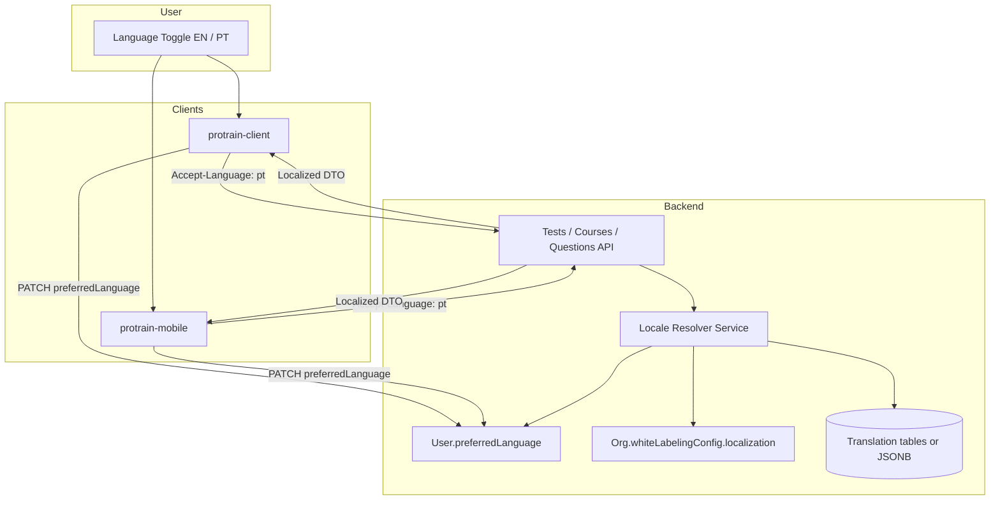

# User Language Change — English & Portuguese Support

This document describes how to add **Portuguese (`pt`)** language support across the ProTrain platform so users who do not fully understand English can take and submit tests in their preferred language.

It covers the **backend** (`pro-train`), **web client** (`protrain-client`), and **mobile app** (`protrain-mobile`), with a phased implementation plan and a user-facing language toggle (English / Português).

---

## Table of Contents

1. [Executive Summary](#executive-summary)
2. [Current State](#current-state)
3. [Two Layers of Localization](#two-layers-of-localization)
4. [Target Architecture](#target-architecture)
5. [Language Resolution Rules](#language-resolution-rules)
6. [Phase Plan](#phase-plan)
7. [Backend Changes (`pro-train`)](#backend-changes-pro-train)
8. [Web Client Changes (`protrain-client`)](#web-client-changes-protrain-client)
9. [Mobile App Changes (`protrain-mobile`)](#mobile-app-changes-protrain-mobile)
10. [Admin & Content Authoring](#admin--content-authoring)
11. [Test Submission & Grading](#test-submission--grading)
12. [User Language Toggle UX](#user-language-toggle-ux)
13. [Additional Considerations](#additional-considerations)
14. [Testing Checklist](#testing-checklist)
15. [Decision Log](#decision-log)
16. [File Reference](#file-reference)

---

## Executive Summary

ProTrain is **English-only today** at every layer:

| Layer | UI strings | Test/course content | User language preference |
|-------|------------|---------------------|--------------------------|
| Backend | N/A | Single string columns per field | **Not stored on user** |
| Web client | Hardcoded English | Rendered as returned by API | **Not implemented** |
| Mobile app | Hardcoded English | Rendered as returned by API | **Not implemented** |

The backend already has **organization white-label localization config** (`defaultLanguage`, `supportedLanguages`, `allowUserLanguageChange`, `languageSelector`) intended for clients, but:

- Portuguese (`pt`) is **not** in default supported languages.
- No API resolves content by locale.
- No user field persists an individual language choice.
- Clients do not read or act on this config.

To support Portuguese test-taking end-to-end you need **both**:

1. **UI localization** — translate buttons, labels, toasts, navigation, validation messages (client-side i18n).
2. **Content localization** — store and serve Portuguese versions of test questions, options, course titles, etc. (backend + admin tooling).

UI-only changes let users see Portuguese chrome but **English questions**. Content changes are required for users to read and answer tests in Portuguese.

---

## Current State

### Backend (`pro-train`)

**Org-level localization (exists, unused for content):**

```typescript
// src/org/interfaces/organization.interface.ts
localization: {
  defaultLanguage: string;           // e.g. 'en'
  supportedLanguages: string[];      // e.g. ['en', 'es', 'fr']
  allowUserLanguageChange: boolean;
  region: string;
  timezone: string;
  dateFormat: string;
  timeFormat: '12h' | '24h';
  currency: string;
  numberFormat: { decimal: string; thousands: string };
};
dashboard.features.languageSelector: boolean;
```

Defaults in `src/org/entities/org.entity.ts`: `supportedLanguages: ['en', 'es', 'fr']` — **no `pt`**.

**User entity (`src/user/entities/user.entity.ts`):** no `language` or `preferences` field. Profile API (`GET/PUT /user/profile`) supports name, email, username, avatar only.

**Content model — single language per field:**

| Entity | Table | Localizable text fields |
|--------|-------|-------------------------|
| Course | `courses` | `title`, `description` |
| Test | `tests` | `title`, `description` |
| Question | `questions` | `questionText`, `mediaInstructions`, `explanation`, `hint` |
| QuestionOption | `question_options` | `optionText` |
| Answer | `answers` | `textAnswer` (user submission — any language) |

**Quiz structure:** There is no separate Quiz entity. Quizzes are `Test` records with `testType: 'quiz'`.

**Test-taking API flow:**

```
GET  /tests/:id                    → test + questions + options
POST /test-attempts/start          → { testId }
POST /test-attempts/:id/submit     → { answers[], finalReview, confirmSubmission }
POST /answers/auto-mark/:attemptId → grades multiple_choice / true_false
```

No `Accept-Language` header or `?locale=` query parameter is handled today.

> **Note:** `docs/user-preferences.md` in this repo describes a LORO-S project pattern (Clerk, JSON preferences column). It is **not** implemented in ProTrain. Do not use it as a source of truth.

### Web Client (`protrain-client`)

- **No i18n library** in `package.json` (no `next-intl`, `react-i18next`, etc.).
- `<html lang="en">` hardcoded in `app/client.tsx`.
- Primary test-taking UI: `app/test/[testID]/page.tsx` (~1,000+ lines, English strings inline).
- Submission: `POST /test-attempts/:id/submit` via `services/test-service.ts`.
- Profile: `components/admin/user-profile-management.tsx` — no language setting.
- API client (`lib/api-client.ts`): no `Accept-Language` header.

### Mobile App (`protrain-mobile`)

- **No i18n library** in `package.json` (no `expo-localization`, `i18next`, etc.).
- Primary test screen: `src/app/test/[testId].tsx`.
- Submission: `src/services/test-service.ts` → `POST /test-attempts/:id/submit`.
- Profile: `src/app/(tabs)/profile.tsx` — edit profile and change password only.
- API client (`src/lib/api-client.ts`): no locale header.
- ~200+ source files with hardcoded English UI strings.

---

## Two Layers of Localization

Understanding this split avoids a common pitfall: translating the UI while leaving questions in English.

### Layer 1 — Platform UI (client responsibility)

Examples: "Submit Test", "Previous", "Time remaining", tab labels, login form, error toasts.

| Approach | Pros | Cons |
|----------|------|------|
| Client-side JSON catalogs (`en.json`, `pt.json`) | Fast to ship for UI; no backend change for chrome only | Does not translate API content |
| Shared translation keys across web + mobile | Consistent terminology | Requires discipline and naming convention |

**Recommended libraries:**

- Web: [`next-intl`](https://next-intl.dev/) (Next.js 15 App Router)
- Mobile: [`i18next`](https://www.i18next.com/) + [`react-i18next`](https://react.i18next.com/) + [`expo-localization`](https://docs.expo.dev/versions/latest/sdk/localization/) for device default

### Layer 2 — Training & test content (backend + admin responsibility)

Examples: question text, answer options, course titles, explanations shown after submission.

Requires **database schema** and **API locale resolution** so `GET /tests/:id?locale=pt` returns Portuguese question text when available, falling back to English.

---

## Target Architecture



**Locale resolution priority (recommended):**

1. Explicit request: `?locale=pt` or `Accept-Language: pt`
2. Authenticated user's `preferredLanguage`
3. Organization `defaultLanguage`
4. Fallback: `en`

---

## Language Resolution Rules

Define these once in the backend and mirror behavior in clients.

| Rule | Behavior |
|------|----------|
| Supported locales | Org `supportedLanguages` must include `pt` before toggle is shown |
| User override | Allowed only when `allowUserLanguageChange === true` |
| Toggle visibility | Shown when `dashboard.features.languageSelector === true` |
| Content fallback | If Portuguese translation missing for a field, return English value |
| Partial translations | Return mixed locale content rather than failing the request |
| Attempt locale | Store `locale` on `test_attempts` at start time for audit and consistent grading context |
| Admin default | Admin UI continues to author in English; translations are additive |

**Portuguese variant:** Use **`pt`** (ISO 639-1). Default copy should target **Brazilian Portuguese (`pt-BR`)** unless your organization standard is European Portuguese (`pt-PT`). Clients can use `pt` as the key; format dates with `pt-BR` or `pt-PT` via org region if needed later.

---

## Phase Plan

### Phase 0 — Discovery & decisions (1–2 days)

**Goal:** Align stakeholders on scope and Portuguese variant.

| Task | Owner |
|------|-------|
| Confirm `pt-BR` vs `pt-PT` for UI copy and content | Product |
| List priority screens: test-taking, results, auth, profile | Product + Engineering |
| Inventory existing tests/courses that need Portuguese content | Content / L&D |
| Add `pt` to org `supportedLanguages` for pilot org(s) | Backend / Admin |
| Deprecate or rewrite misleading `docs/user-preferences.md` | Engineering |

**Deliverable:** Signed-off scope (UI-only pilot vs full content localization).

---

### Phase 1 — User preference & org config (Backend foundation)

**Goal:** Persist and expose language choice; enable org-level Portuguese.

#### Add / alter

| Item | Action |
|------|--------|
| `users.preferredLanguage` | **Add** column — `varchar(5)`, nullable, default `null` (falls back to org default) |
| `User` entity | **Add** `preferredLanguage?: string` |
| `UpdateUserProfileDto` | **Add** optional `preferredLanguage` with validation against org `supportedLanguages` |
| `GET /user/profile` | **Return** `preferredLanguage` |
| `PUT /user/profile` | **Accept** `preferredLanguage` when `allowUserLanguageChange` is true |
| Auth sign-in response | **Include** `preferredLanguage` on user object |
| Org defaults | **Add** `'pt'` to `supportedLanguages` in entity defaults and Swagger examples |
| Migration | **Create** TypeORM migration for `preferredLanguage` |

#### Optional (recommended)

| Item | Action |
|------|--------|
| `GET /user/preferences` | **Add** dedicated endpoint if profile payload should stay minimal |
| Locale guard/interceptor | **Add** NestJS interceptor to parse `Accept-Language` and attach `request.locale` |

**Example DTO validation:**

```typescript
@IsOptional()
@Matches(/^[a-z]{2}(-[A-Z]{2})?$/)
preferredLanguage?: string;
```

**Deliverable:** API can store and return user language; org config includes `pt`.

---

### Phase 2 — Content localization model (Backend)

**Goal:** Store and serve Portuguese test/course content.

#### Recommended approach: translation sidecar tables

Keeps existing English columns as canonical fallback and avoids breaking current clients.

**Add tables:**

```sql
-- Example shape (adjust naming to project conventions)
test_translations (
  id UUID PK,
  test_id INT FK → tests,
  locale VARCHAR(5) NOT NULL,  -- 'pt', 'en'
  title VARCHAR,
  description TEXT,
  UNIQUE(test_id, locale)
);

question_translations (
  id UUID PK,
  question_id INT FK → questions,
  locale VARCHAR(5) NOT NULL,
  question_text TEXT,
  explanation TEXT,
  hint TEXT,
  media_instructions TEXT,
  UNIQUE(question_id, locale)
);

question_option_translations (
  id UUID PK,
  option_id INT FK → question_options,
  locale VARCHAR(5) NOT NULL,
  option_text VARCHAR,
  UNIQUE(option_id, locale)
);

course_translations ( ... );  -- title, description
```

**Alternative:** JSONB `translations` column on each entity, e.g. `{ "en": { "title": "..." }, "pt": { "title": "..." } }`. Faster to prototype; harder to query and validate at scale.

#### Add / alter services

| Service | Change |
|---------|--------|
| `TestService.findOne` | Resolve locale; merge translation over base fields |
| `QuestionsService.findByTestId` | Return localized `questionText`, options |
| `CourseService` | Localize title/description |
| `CreateTestDto` / update DTOs | Accept optional `translations: Record<locale, ...>` for admin |
| `TestAttemptsService.start` | Persist `locale` on attempt record |
| New `LocaleService` | Centralize resolution + fallback logic |

#### API changes

| Endpoint | Change |
|----------|--------|
| `GET /tests/:id` | Support `?locale=pt` and `Accept-Language` |
| `GET /questions/test/:testId` | Same |
| `GET /courses/:id` | Same |
| Admin create/update | Accept nested translations block |

**Deliverable:** API returns Portuguese question text when translations exist.

---

### Phase 3 — Web client UI i18n + toggle

**Goal:** English/Portuguese UI with user preference sync.

#### Add dependencies

```bash
npm install next-intl
```

#### Add / alter

| Item | Action |
|------|--------|
| `messages/en.json`, `messages/pt.json` | **Create** translation catalogs |
| `i18n/request.ts` or middleware | **Configure** locale detection (cookie + user preference) |
| `middleware.ts` | **Extend** auth middleware with locale cookie handling |
| `app/client.tsx` | **Dynamic** `<html lang={locale}>` |
| `lib/api-client.ts` | **Add** `Accept-Language` interceptor from active locale |
| `types/api.ts` | **Add** `preferredLanguage` to `User` |
| `services/user-service.ts` | **Send** `preferredLanguage` on profile update |
| Profile / settings UI | **Add** language select (English / Português) |
| Header (optional) | **Add** compact toggle when `languageSelector` enabled |
| `app/test/[testID]/page.tsx` | **Extract** all UI strings to message keys (high priority) |
| `lib/resolve-submission-error-message.ts` | **Localize** error messages |
| Date formatting | **Use** `Intl.DateTimeFormat(locale)` |

#### Locale bootstrap on login

```typescript
// Pseudocode — after auth success
const userLocale = user.preferredLanguage
  ?? org.whiteLabelingConfig.localization.defaultLanguage
  ?? 'en';
setLocaleCookie(userLocale);
```

**Deliverable:** Web users can switch EN/PT; UI reflects choice; API requests include locale header.

---

### Phase 4 — Mobile app UI i18n + toggle

**Goal:** Parity with web for learner test-taking flow.

#### Add dependencies

```bash
npx expo install expo-localization
npm install i18next react-i18next
```

#### Add / alter

| Item | Action |
|------|--------|
| `src/locales/en.json`, `src/locales/pt.json` | **Create** catalogs (share keys with web where possible) |
| `src/lib/i18n.ts` | **Initialize** i18next with fallback `en` |
| `src/providers/i18n-provider.tsx` | **Wrap** app in `src/app/_layout.tsx` |
| AsyncStorage key `@protrain/locale` | **Persist** user choice locally |
| `src/lib/api-client.ts` | **Add** `Accept-Language` header |
| `src/types/profile-type.ts` | **Add** `preferredLanguage` |
| `src/services/user-service.ts` | **Sync** preference to backend on change |
| `src/app/(tabs)/profile.tsx` | **Add** Language section with EN / PT toggle |
| `src/app/test/[testId].tsx` | **Extract** strings (Start test, Submit, Previous, etc.) |
| `src/components/loader/hourglass-calculation-loader.tsx` | **Translate** `CALCULATION_MESSAGES` |
| Tab bar titles | **Use** `t('tabs.home')` etc. in `(tabs)/_layout.tsx` |
| Zod schemas | **Use** `i18n.t()` for validation messages |
| Date utils | **Centralize** formatting with active locale |

#### Bootstrap order

1. Load AsyncStorage saved locale
2. Else use `user.preferredLanguage` from auth
3. Else use `expo-localization` device locale if supported by org
4. Else org `defaultLanguage`
5. Else `en`

**Deliverable:** Mobile users can take tests with Portuguese UI; preference syncs across devices when logged in.

---

### Phase 5 — Admin content authoring & rollout

**Goal:** Portuguese test content available for production users.

| Task | Action |
|------|--------|
| Admin test form | **Add** translation tabs (EN / PT) for title, description, questions, options |
| Bulk import | **Support** CSV/JSON with locale column |
| Content migration | **Backfill** Portuguese for priority courses/tests |
| Pilot org | Enable `supportedLanguages: ['en', 'pt']`, `languageSelector: true` |
| QA | Run full test submission flow in both languages |
| Documentation | Train admins on authoring bilingual tests |
| Email templates | Add Portuguese `.hbs` templates if transactional emails are in scope |

**Deliverable:** Users can read questions in Portuguese and submit successfully.

---

## Backend Changes (`pro-train`)

### New migration (example)

```typescript
// src/migrations/XXXXXXXX-add-user-preferred-language.ts
await queryRunner.addColumn('users', new TableColumn({
  name: 'preferredLanguage',
  type: 'varchar',
  length: '5',
  isNullable: true,
}));

await queryRunner.addColumn('test_attempts', new TableColumn({
  name: 'locale',
  type: 'varchar',
  length: '5',
  isNullable: true,
  default: "'en'",
}));
```

### LocaleService (sketch)

```typescript
@Injectable()
export class LocaleService {
  resolveLocale(params: {
    queryLocale?: string;
    acceptLanguage?: string;
    userPreferred?: string;
    orgDefault: string;
    supported: string[];
  }): string {
    const candidates = [
      params.queryLocale,
      params.userPreferred,
      this.parseAcceptLanguage(params.acceptLanguage),
      params.orgDefault,
      'en',
    ].filter(Boolean) as string[];

    for (const locale of candidates) {
      const base = locale.split('-')[0];
      if (params.supported.includes(locale) || params.supported.includes(base)) {
        return params.supported.includes(locale) ? locale : base;
      }
    }
    return params.orgDefault ?? 'en';
  }
}
```

### Endpoints to extend

| Module | File | Priority |
|--------|------|----------|
| User profile | `src/user/user.controller.ts`, `user.service.ts` | P0 |
| Tests | `src/test/test.service.ts`, `test.controller.ts` | P0 |
| Questions | `src/questions/questions.service.ts` | P0 |
| Test attempts | `src/test_attempts/test_attempts.service.ts` | P1 |
| Courses | `src/course/course.service.ts` | P2 |
| Org config | `src/org/entities/org.entity.ts` | P0 |

---

## Web Client Changes (`protrain-client`)

### Priority files for string extraction

| Priority | File | Reason |
|----------|------|--------|
| P0 | `app/test/[testID]/page.tsx` | Core test-taking experience |
| P0 | `components/test-submission-failed-modal.tsx` | Submission errors |
| P0 | `components/admin/edit-user-modal.tsx` or profile management | Language toggle |
| P0 | `lib/api-client.ts` | Locale header |
| P1 | `hooks/tests/use-test-attempts.ts` | Toast messages |
| P1 | `app/test-results/[testId]/page.tsx` | Post-test feedback |
| P1 | `components/tests-section.tsx` | Test discovery |
| P2 | `components/nav-header.tsx`, `app/page.tsx` | General navigation |
| P3 | `components/admin/*`, `components/landing/*` | Admin & marketing |

### Example message catalog structure

```json
// messages/pt.json
{
  "common": {
    "submit": "Enviar",
    "previous": "Anterior",
    "next": "Próximo",
    "cancel": "Cancelar",
    "loading": "Carregando..."
  },
  "test": {
    "startTest": "Iniciar teste",
    "submitTest": "Enviar teste",
    "timeRemaining": "Tempo restante",
    "confirmSubmit": "Tem certeza de que deseja enviar?",
    "true": "Verdadeiro",
    "false": "Falso"
  },
  "profile": {
    "language": "Idioma",
    "languageEnglish": "English",
    "languagePortuguese": "Português"
  }
}
```

### Fetch localized test content

```typescript
// services/test-service.ts
export async function getTest(testId: string, locale?: string) {
  return apiClient.get(`/tests/${testId}`, {
    params: locale ? { locale } : undefined,
    headers: locale ? { 'Accept-Language': locale } : undefined,
  });
}
```

---

## Mobile App Changes (`protrain-mobile`)

### Priority files

| Priority | File |
|----------|------|
| P0 | `src/app/test/[testId].tsx` |
| P0 | `src/components/learner/question-view.tsx` |
| P0 | `src/components/learner/test-progress-panel.tsx` |
| P0 | `src/lib/api-client.ts` |
| P0 | `src/app/(tabs)/profile.tsx` |
| P1 | `src/app/(auth)/login.tsx` |
| P1 | `src/app/(tabs)/_layout.tsx` |
| P1 | `src/app/test-results/[testId].tsx` |
| P1 | `src/components/loader/hourglass-calculation-loader.tsx` |
| P2 | Admin screens under `src/app/admin/` |

### Profile language toggle (sketch)

```tsx
function LanguageSelector() {
  const { i18n } = useTranslation();
  const { user, refreshUser } = useAuth();

  const setLanguage = async (code: 'en' | 'pt') => {
    await i18n.changeLanguage(code);
    await AsyncStorage.setItem('@protrain/locale', code);
    await userService.updateProfile({ preferredLanguage: code });
    await refreshUser();
  };

  return (
    <View>
      <Text>{t('profile.language')}</Text>
      <SegmentedControl
        values={['English', 'Português']}
        selectedIndex={i18n.language === 'pt' ? 1 : 0}
        onChange={(i) => setLanguage(i === 1 ? 'pt' : 'en')}
      />
    </View>
  );
}
```

Respect org flags: hide selector when `allowUserLanguageChange === false` or `languageSelector === false`.

---

## Admin & Content Authoring

Admins need a way to enter Portuguese alongside English.

### Recommended admin UX

1. **Tabbed editor** on test form: `English | Português`
2. **Fallback indicator** when PT field is empty ("Will show English to users")
3. **Preview** in both languages before publish
4. **Validation:** require English; Portuguese optional until content team fills it

### Content strategies

| Strategy | When to use |
|----------|-------------|
| **Bilingual tests** | Same test ID; translations linked by question/option ID | Default — grading uses stable IDs |
| **Separate PT test** | Duplicate test record with Portuguese content only | Quick workaround without schema changes; harder to report on |
| **External translation** | Export JSON → translate → import | Large backfill |

**Prefer bilingual linked translations** so analytics and grading remain unified.

### Files to extend (web admin)

- `components/tests/test-form.tsx` — add translation inputs
- `components/tests/test-detail.tsx` — show locale coverage status
- New admin API endpoints or extend existing `POST /tests`, `PUT /tests/:id`

---

## Test Submission & Grading

### What stays language-independent

| Question type | Submission field | Grading |
|---------------|------------------|---------|
| Multiple choice | `selectedOptionId` | Compares option IDs — **safe across locales** |
| True/false (ID-based) | `selectedOptionId` | **Safe** |
| True/false (text-based legacy) | `textAnswer` vs `optionText` | **Risky** — "True"/"Verdadeiro" mismatch |

Ensure clients always submit **`selectedOptionId`** for true/false and multiple choice, not localized label text.

### What needs care

| Question type | Notes |
|---------------|-------|
| Short answer | Not auto-marked today — manual review can use any language |
| Essay | Manual marking — reviewers should see attempt `locale` |
| Fill in blank | If auto-marking is added later, match against locale-specific acceptable answers |

### Submit payload (unchanged shape)

```typescript
{
  answers: [
    { questionId: number; selectedOptionId?: number; answerText?: string; timeSpent?: number }
  ],
  finalReview: boolean,
  confirmSubmission: boolean
}
```

**Store `locale` on the test attempt** at start time so results and audit trails reflect the language the user saw.

---

## User Language Toggle UX

### Where to place the toggle

| Location | Use case |
|----------|----------|
| **Profile / Settings** | Primary — persistent preference |
| **Header / app bar** | Quick switch during test prep (when `languageSelector` enabled) |
| **Pre-test instructions screen** | Last chance to switch before starting |

### Toggle behavior

1. User selects **Português**.
2. Client updates i18n immediately (no full reload required).
3. Client saves to backend (`preferredLanguage: 'pt'`) and local storage.
4. Client refetches active test/course with `Accept-Language: pt`.
5. If org disallows change, show read-only current language.

### First-time / logged-out users

- Web: default from browser `Accept-Language` if `pt` is supported; else org default.
- Mobile: default from `expo-localization`; else org default from sign-in response.

---

## Additional Considerations

### Emails & notifications

- `src/communications/interfaces/template.interface.ts` defines `language` on render options but it is **not implemented**.
- Phase 5+: Portuguese password reset, invitation, and test reminder templates.

### Error messages from API

- NestJS validation and exception messages are English today.
- Optional: add `nestjs-i18n` for server-generated errors, or map known error codes to client-side translations (simpler).

### Accessibility

- Set `lang` attribute / `accessibilityLanguage` when locale changes.
- Screen readers should use the active locale.

### SEO (web marketing pages)

- Landing pages (`components/landing/*`) can remain English-only initially.
- Add `/pt` routes later if public marketing localization is required.

### Performance

- Cache localized test payloads keyed by `(testId, locale)`.
- Invalidate cache when translations update.

### Security

- Validate `preferredLanguage` against org `supportedLanguages` server-side — do not trust client-only checks.

### Reporting & analytics

- Include `locale` dimension in test attempt reports.
- Track translation coverage (% of questions with PT text).

### Shared translation keys (web + mobile)

Maintain a **shared glossary** (spreadsheet or monorepo package) for terms like "Submit", "Pass", "Fail", "Course", "Quiz" so both apps stay consistent.

---

## Testing Checklist

### Backend

- [ ] User can set `preferredLanguage` to `pt` via profile API
- [ ] Invalid locale rejected when not in org `supportedLanguages`
- [ ] `GET /tests/:id?locale=pt` returns Portuguese when translation exists
- [ ] Missing PT translation falls back to English field
- [ ] Test attempt stores `locale` at start
- [ ] Org with `allowUserLanguageChange: false` rejects preference update

### Web client

- [ ] Language toggle saves and persists after reload
- [ ] Test page UI shows Portuguese labels
- [ ] Questions/options display Portuguese from API
- [ ] Submit succeeds with same scores as English for multiple choice
- [ ] `<html lang="pt">` when Portuguese active
- [ ] Dates formatted for Portuguese locale

### Mobile app

- [ ] Toggle on profile switches UI immediately
- [ ] Preference syncs after login on second device
- [ ] Test flow: start → answer → submit → results in Portuguese
- [ ] Offline/locale: AsyncStorage restores last choice
- [ ] Tab bar and auth screens translated

### Grading

- [ ] Multiple choice: correct answers match regardless of display locale
- [ ] True/false uses option IDs, not localized strings
- [ ] Results page shows explanations in attempt locale

### Edge cases

- [ ] User switches language mid-test (define policy: allow with refetch, or lock at attempt start)
- [ ] Mixed translation coverage (some questions PT, some EN only)
- [ ] Org removes `pt` from supported languages — user preference falls back gracefully

---

## Decision Log

| Decision | Recommendation | Rationale |
|----------|----------------|-----------|
| Portuguese code | `pt` (ISO 639-1) | Matches existing org config pattern |
| UI copy variant | `pt-BR` default | Broader learner base; adjust if org is Portugal-focused |
| Content storage | Sidecar translation tables | Non-breaking; English columns remain fallback |
| User field | `users.preferredLanguage` column | Simple; org JSON already has org-level config |
| Client libraries | next-intl (web), i18next (mobile) | Ecosystem fit for each platform |
| Mid-test language switch | **Lock locale at attempt start** | Avoids question text changing mid-attempt |
| Scope order | Backend preference → content API → client UI → admin authoring | Unblocks incremental delivery |

---

## File Reference

### Backend (`pro-train`)

| Purpose | Path |
|---------|------|
| Org localization interface | `src/org/interfaces/organization.interface.ts` |
| Org entity defaults | `src/org/entities/org.entity.ts` |
| User entity | `src/user/entities/user.entity.ts` |
| User controller | `src/user/user.controller.ts` |
| Test entity | `src/test/entities/test.entity.ts` |
| Question entity | `src/questions/entities/question.entity.ts` |
| Question option entity | `src/questions_options/entities/questions_option.entity.ts` |
| Test attempts service | `src/test_attempts/test_attempts.service.ts` |
| Answers / auto-mark | `src/answers/answers.service.ts` |
| Auth (org config in response) | `src/auth/auth.service.ts` |

### Web (`protrain-client`)

| Purpose | Path |
|---------|------|
| Test-taking page | `app/test/[testID]/page.tsx` |
| Test service | `services/test-service.ts` |
| API client | `lib/api-client.ts` |
| User types | `types/api.ts` |
| User service | `services/user-service.ts` |
| Profile UI | `components/admin/user-profile-management.tsx` |
| Root layout | `app/client.tsx`, `app/layout.tsx` |
| Middleware | `middleware.ts` |

### Mobile (`protrain-mobile`)

| Purpose | Path |
|---------|------|
| Test screen | `src/app/test/[testId].tsx` |
| Test service | `src/services/test-service.ts` |
| API client | `src/lib/api-client.ts` |
| Profile tab | `src/app/(tabs)/profile.tsx` |
| App layout | `src/app/_layout.tsx` |
| Question view | `src/components/learner/question-view.tsx` |
| User service | `src/services/user-service.ts` |

---

## Summary

Implementing Portuguese test-taking requires coordinated work across all three repositories:

1. **Backend** — user `preferredLanguage`, translation storage, locale-aware content APIs, attempt locale tracking.
2. **Web & mobile** — i18n libraries, EN/PT message catalogs, profile/header toggle, `Accept-Language` on API calls.
3. **Admin** — bilingual content authoring for tests, questions, and options.
4. **Grading** — continue submitting option IDs so scores remain correct regardless of display language.

Phases 1 and 3 can deliver a **Portuguese UI with English questions** quickly. Phase 2 and 5 are required for users to **read and answer tests in Portuguese** and submit with full comprehension of the material.
