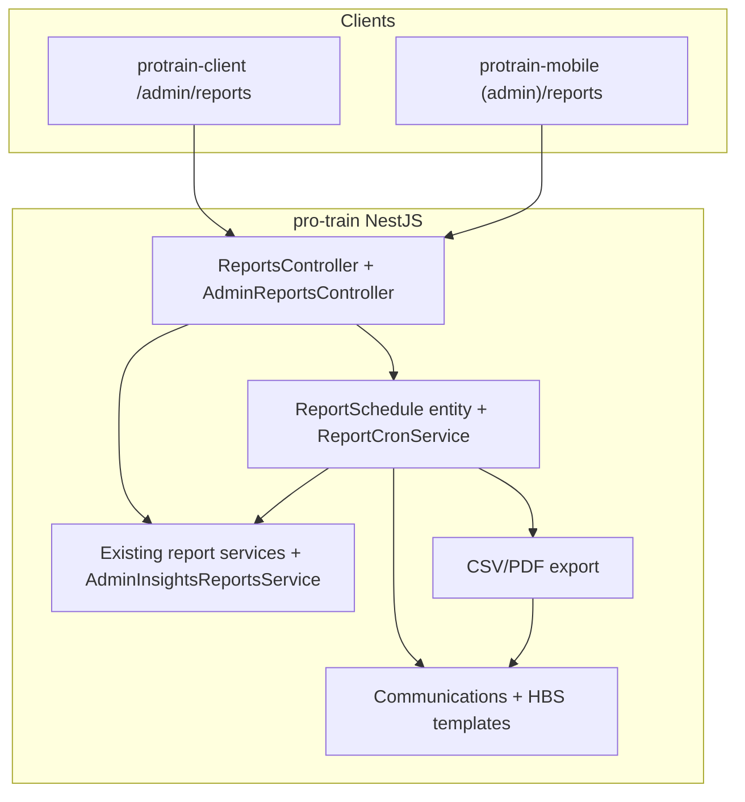

# Admin Reporting System — Implementation Plan

Status tracker for the ProTrain Admin Reporting System across `pro-train` (NestJS), `protrain-client` (Next.js), and `protrain-mobile` (Expo).

**Last updated:** 2026-07-22

---

## Decisions

| Decision | Choice |
|----------|--------|
| Access roles | `owner`, `admin`, and `master_admin` |
| PDF timing | CSV in Phase 2; PDFs added later |
| `/analytics` vs `/reports/admin` | Keep both — `/analytics` remains for existing branch widgets; admin catalogue lives under `/reports/admin` |
| Schedule activate/deactivate | `master_admin`, `admin`, and `owner` can set `isActive`; inactive schedules never send emails |

---

## Current State (baseline)

| Layer | Already exists | Gaps |
|-------|----------------|------|
| **Backend `/reports`** | 19 GET analytics endpoints + 6 services + cache | Originally JWT-only; weak org/branch scoping; no export/schedule |
| **Backend `/analytics`** | Branch summary + top/worst performers (`OWNER` / `MASTER_ADMIN`) | Narrow surface; not a full report catalogue |
| **Email** | Handlebars templates + SMTP attachments + queue | Report delivery added in Phase 2 |
| **Cron** | `@nestjs/schedule` (rewards, health) | Report cron added in Phase 2 |
| **Web** | `/admin/*`, `reportsService`, Recharts/Shadcn charts | Reporting hub + schedules (Phases 3–2) |
| **Mobile** | `(admin)` hub, SVG charts, `reportsService`, branch analytics | Reporting hub + schedules (Phase 4) |

---

## Architecture



**Access:** `JwtAuthGuard` + `RolesGuard` + `@Roles(OWNER, ADMIN, MASTER_ADMIN)`.

---

## Required Reports & Insights

### Core Reports
- Top Performers within each branch
- Worst Performers within each branch
- Top Performers across all branches
- Current Training Hours per user
- Top 5 most commonly failed tests
- Top 5 most commonly passed tests
- Average Pass Rate per test/course
- Users with highest knowledge score improvement (week/month)
- Users with lowest knowledge score improvement (week/month)
- Leaderboard views: overall + per branch

### Insightful Additional Reports
- Branch performance comparison
- Course completion rates and knowledge score distribution
- Users at risk (low engagement + low improvement)
- Most challenging questions/answer patterns (common wrong answers)
- Training effectiveness trends over time
- Skill gap analysis per course/module
- High-potential users (strong improvement + high absolute scores)

### Key Area Identification
Automatically detect courses/tests where employees need more training based on:
- Low average knowledge scores
- High failure rates
- Common incorrect answers
- Stagnant or declining knowledge scores

---

## Phase Status

| Phase | Description | Status |
|-------|-------------|--------|
| **Phase 1** | Admin insights API + role/org scoping | ✅ **Completed** |
| **Phase 2** | Scheduling, email, CSV export (PDF later) | ✅ **Completed** |
| **Phase 3** | Web Admin Reporting hub (dashboard consuming Phase 1) | ✅ **Completed** (hub + schedules UI) |
| **Phase 4** | Mobile Admin Reporting screens | ✅ **Completed** |
| **Phase 5** | Polish: PDF attachments, motivational digests polish, offline cache | ⬜ Pending |

---

## Phase 1 — Secure & complete the admin report API

**Status:** ✅ Completed (2026-07-22)

Lock down + fill missing report queries. Org-scoped, role-gated admin catalogue.

### Backend file changes

| Action | Path | Done |
|--------|------|------|
| Add | `src/reports/services/admin-insights-reports.service.ts` | ✅ |
| Add | `src/reports/controllers/admin-reports.controller.ts` | ✅ |
| Add | `src/reports/dto/admin-insights.dto.ts` | ✅ |
| Extend | `src/reports/reports.module.ts` — register service, controller, `TrainingSession` | ✅ |
| Add | `reporting-analytics.md` (this status file) | ✅ |
| Reuse | `/analytics/branches/*` patterns for performers / hours / org scoping | ✅ |

### Admin endpoints (`/reports/admin/*`)

```
GET /reports/admin/overview
GET /reports/admin/performers
GET /reports/admin/training-hours
GET /reports/admin/tests/pass-fail-ranking
GET /reports/admin/pass-rates
GET /reports/admin/knowledge-improvement
GET /reports/admin/leaderboards
GET /reports/admin/branch-comparison
GET /reports/admin/at-risk-users
GET /reports/admin/high-potential-users
GET /reports/admin/challenging-questions
GET /reports/admin/skill-gaps
GET /reports/admin/key-areas
GET /reports/admin/effectiveness-trends
```

**Roles:** `owner` | `admin` | `master_admin`  
**Scoping:** All queries require org context from JWT (`OrgBranchScope`); optional `branchId` filter.

---

## Phase 2 — Scheduling, email, export

**Status:** ✅ Completed (2026-07-22)

| Action | Path | Done |
|--------|------|------|
| Add entities | `ReportSchedule`, `ReportRun` | ✅ |
| Add migration | `1740400000000-CreateReportScheduleTables.ts` | ✅ |
| Add | `src/reports/services/report-schedule.service.ts` | ✅ |
| Add | `src/reports/services/report-cron.service.ts` (`*/15 * * * *`) | ✅ |
| Add | `src/reports/services/report-export.service.ts` (CSV) | ✅ |
| Add templates | `templates/admin-report.hbs` (+ `.txt.hbs`) | ✅ |
| Extend | `EmailType.ADMIN_REPORT` + `CommunicationsService.sendAdminReportEmail` | ✅ |
| Add CRUD | schedules + `PATCH .../active` + generate + preview + runs | ✅ |
| Web UI | `/admin/reports/schedule` activate/deactivate | ✅ |

### Schedule model
- `orgId`, `createdByUserId`, `reportType(s)`, `filters` (JSON), `frequency` (`weekly`|`monthly`), `dayOfWeek`/`dayOfMonth`, `timeUtc`, `timezone`, `recipientUserIds[]` / `recipientEmails[]` / `recipientRoles[]`, `includeCsv`, `includeMotivationalLeaderboard`, `isActive`
- **Inactive (`isActive=false`) schedules are skipped by cron and never send emails**
- Activate/deactivate via `PATCH /reports/admin/schedules/:id/active` — available to `master_admin`, `owner`, `admin`

### Schedule / delivery endpoints

```
GET    /reports/admin/preview
POST   /reports/admin/generate
GET    /reports/admin/schedules
POST   /reports/admin/schedules
GET    /reports/admin/schedules/:id
PATCH  /reports/admin/schedules/:id
PATCH  /reports/admin/schedules/:id/active
DELETE /reports/admin/schedules/:id
GET    /reports/admin/runs
```

---

## Phase 3 — Web Admin Reporting UI (`protrain-client`)

**Status:** ✅ Completed (hub + schedules) (2026-07-22)

| Action | Path | Done |
|--------|------|------|
| Add | `app/admin/reports/page.tsx` — hub | ✅ |
| Add | `app/admin/reports/schedule/page.tsx` | ✅ |
| Add | `components/admin/admin-reports-dashboard.tsx` | ✅ |
| Add | `components/admin/admin-report-schedules-panel.tsx` | ✅ |
| Add | `types/admin-reports.ts` | ✅ |
| Extend | `services/reports-service.ts` — overview + schedules + generate | ✅ |
| Extend | `components/nav-header.tsx` — “Reports” for admin roles | ✅ |
| Wrap | `RoleGuard` on report pages (`master_admin` \| `owner` \| `admin`) | ✅ |

**UX:** timeframe filter → overview KPIs → performers, pass/fail, at-risk, high-potential, key areas, branch comparison, trends → schedules with activate/deactivate.

---

## Phase 4 — Mobile Admin Reporting (`protrain-mobile`)

**Status:** ✅ Completed (2026-07-22)

| Action | Path | Done |
|--------|------|------|
| Add | `src/app/(admin)/reports/index.tsx` — hub | ✅ |
| Add | `src/app/(admin)/reports/schedule.tsx` | ✅ |
| Extend | `src/services/reports-service.ts` + `types/reports-type.ts` | ✅ |
| Add | `src/hooks/use-admin-reports.ts` | ✅ |
| Extend | `(admin)/index.tsx` — Reporting nav item | ✅ |
| Extend | `(admin)/_layout.tsx` — stack screens | ✅ |

Gate with `isAdmin` (admin / owner / master_admin). Schedule toggles use the same activate/deactivate API.

---

## Suggested build order

1. ~~**Phase 1** — Admin insights API + role/org scoping~~ ✅
2. ~~**Phase 3 (hub only)** — Web dashboard consuming Phase 1~~ ✅
3. ~~**Phase 2** — Schedules + email + CSV~~ ✅
4. ~~**Phase 4** — Mobile hub mirroring web~~ ✅
5. **Phase 5** — PDF attachments, richer motivational digests, offline-friendly mobile cache

---

## Notes

- Knowledge scores are derived from `Result.percentage` (no dedicated knowledge-score entity).
- Training hours come from `TrainingSession` / `TrainingHoursService`.
- Existing learner-facing `/reports/*` endpoints remain available to authenticated users; admin-sensitive catalogue is under `/reports/admin/*` with role guards.
- PDF export remains deferred; CSV attachments ship with scheduled/on-demand emails.
